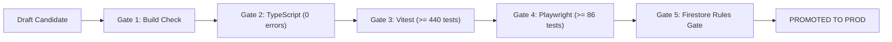

# Orion-9 Wave 10: Deployment Runbook & Release Verification

## 1. Automated Preflight Release Gates

Every production release candidate must pass all 5 automated preflight verification gates prior to deployment:

### Gate Execution Checklist
1. **Build Gate**: `npm run build`
   - Must output client dist bundle and `server.cjs` with zero build errors.
2. **TypeScript Gate**: `npx tsc --noEmit`
   - Zero compiler diagnostic errors or warnings.
3. **Vitest Unit & Integration Gate**: `npx vitest run`
   - 32 test files passing, >= 445 tests passing, 0 failures.
4. **Playwright E2E Gate**: `npx playwright test`
   - 8 test files passing, >= 86 tests passing, 0 failures.
5. **Firestore Emulator Security Gate**:
   - Multi-tenant isolation and immutability rules verified against real Firebase Emulator.

---

## 2. Release Promotion & Canary Sequencing

1. Navigate to `/admin/releases`.
2. Inspect the active candidate release (`v10.0.0-rc1`).
3. Verify all 5 gates report `PASSED`.
4. Click **Promote to Production**.
5. The release stage transitions to `PROMOTED`. Audit record is stored in `releases` collection.

---

## 3. Automated 1-Click Rollback

If a critical regression is detected post-deployment:
1. Navigate to `/admin/releases`.
2. Click **Rollback to [Designated Target]** (e.g., `v9.0.0`).
3. Confirm rollback in modal.
4. The system executes:
   - Atomic reversion of configuration parameters via `configurationService.rollbackToVersion()`.
   - Feature flag emergency disablement.
   - Release state update to `ROLLED_BACK`.
5. Post-rollback telemetry is logged in the `ObservabilityService` audit ledger.
