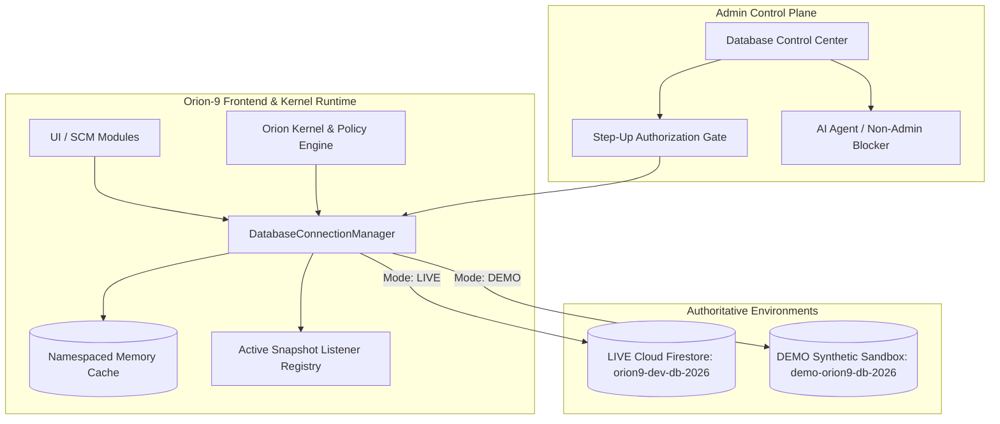

# ORION-9 ENTERPRISE DATABASE ARCHITECTURE SPECIFICATION
**System**: Orion-9 Supply Chain Operating System  
**Classification**: Mission-Critical Enterprise Architecture  
**Database Authority**: Google Cloud Firestore (Multi-Tenant, Governed, Zero-Fabrication)

---

## 1. Executive Summary & Architectural Tenets

Orion-9 is built upon a single authoritative database architecture engineered for zero cross-tenant data leakage, strict multi-environment isolation (LIVE vs. DEMO), real-time reactivity via Firestore snapshot listeners, and human-governed administrative controls.

### Core Architecture Tenets
1. **Single Source of Truth**: All operational supply chain domains (Domains A through R) resolve their persistence and query cache namespaces exclusively through `DatabaseConnectionManager`.
2. **Strict Multi-Tenant Partitioning**: Every collection enforces tenant isolation (`tenantId`, `organizationId`, or dual-key scoped). Cross-tenant queries are blocked at both client query construction and Firestore Security Rule evaluation levels.
3. **Environment Isolation**: The platform operates in either `LIVE` mode (Cloud Firestore project `orion9-dev-db-2026`) or `DEMO` mode (`demo-orion9-db-2026`). No cache, snapshot listener, or outbox mutation can ever bridge across environments.
4. **Governed Step-Up Environment Transitions**: Ordinary users and autonomous AI agents are strictly forbidden from altering database environments. Switching to `LIVE` mode requires human administrator authentication, explicit confirmation phrases, and an auditable operational justification.



---

## 2. Multi-Tenant Partitioning & Identity Boundary

Every document stored within the 18 Orion-9 domains contains authoritative scoping metadata:
- `tenantId`: Identifies the enterprise tenant boundary (e.g., `TENANT_ACME_CORP`, `DEMO_TENANT_ORION`).
- `organizationId`: Identifies the business unit or corporate entity.
- `createdAt` / `updatedAt`: ISO 8601 UTC audit timestamps.
- `version`: Monotonically increasing revision counter for optimistic concurrency control.

### Firestore Security Rule Enforcement Pattern
```javascript
function isOrgMember(tenantId) {
  return request.auth != null && 
         (request.auth.token.tenantId == tenantId || 
          request.auth.token.role == 'platform_admin');
}
```

---

## 3. Cache Namespacing & Query Invalidation

To guarantee that switching between environments or tenants never serves stale or cross-pollinated data, all query cache keys follow an authoritative format:

$$\text{CacheKey} = \text{orion9} : \{\text{environment}\} : \{\text{tenantId}\} : \{\text{collection}\} : \{\text{entityId}\}$$

Examples:
- `orion9:live:tenant_acme:inventory:SKU-9901`
- `orion9:demo:DEMO_TENANT_ORION:inventory:DEMO_SKU_1001`

When `switchEnvironment()` is invoked:
1. `unregisterAllListeners()` cleanly unsubscribes all active Firestore onSnapshot listeners.
2. `clearEnvironmentCache()` purges in-memory caches matching the prior environment prefix.
3. Local storage persistence keys are updated.
4. Latency probe validates connectivity before enabling UI interactions.
