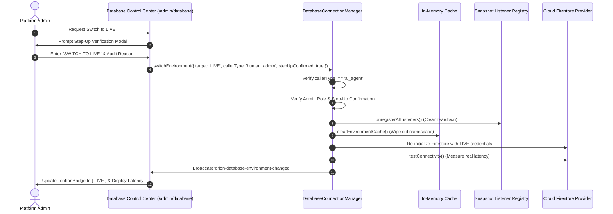

# ORION-9 DATABASE ENVIRONMENT CONTROL PLANE SPECIFICATION
**Control Plane**: Database Control Center (`/admin/database`)  
**Modes**: `LIVE` vs `DEMO`  
**Authorization**: Platform Admin / Org Admin with Step-Up Verification

---

## 1. Environment Topology

### LIVE Mode
- **Cloud Project**: `orion9-dev-db-2026`
- **Auth Domain**: `orion9-dev-db-2026.firebaseapp.com`
- **Cache Prefix**: `orion9:live:`
- **Security Rules**: Production multi-tenant rules (`isOrgMember(tenantId)`)
- **Seeding Guard**: Strictly blocked. Attempting to seed in LIVE throws a hard error.

### DEMO Mode
- **Cloud Project**: `demo-orion9-db-2026`
- **Auth Domain**: `demo-orion9-db-2026.firebaseapp.com`
- **Cache Prefix**: `orion9:demo:`
- **Security Rules**: Isolated sandbox rules with read-only protections for baseline synthetic records.
- **Seeding Guard**: Allowed. Synthetic generators create relationship-consistent mock datasets for training and sales demos.

---

## 2. Governed Transition Protocol

---

## 3. Security Guards & Failure Modes

1. **AI Agent Protection**: Any automated agent attempting to call `switchEnvironment` is immediately rejected with `[DB-GUARD] AI Agents are strictly denied permission to alter database environments.`
2. **Standard User Protection**: Standard buyers, planners, and logistics coordinators cannot access `/admin/database` or trigger environment mutations.
3. **Outbox Guard**: Mutations queued while offline in DEMO mode are stamped with `environment: "DEMO"`. The outbox worker refuses to replay them if the active environment is switched to `LIVE`.
