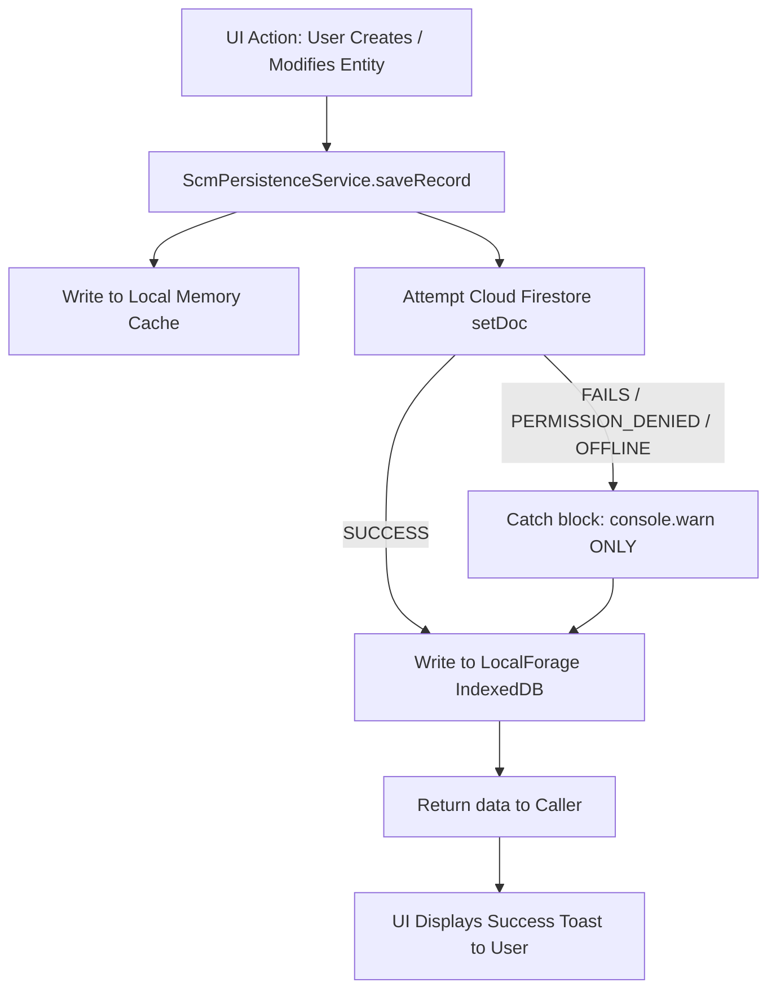

# ORION-9 — DATABASE REALITY & BACKEND VERIFICATION AUDIT
**Authoritative Architectural, Security & Data Reliability Report**  
**Date of Audit**: September 24, 2026  
**Auditor**: Senior Backend Architect, Database Reliability Engineer & QA Auditor  
**Scope**: Codebase Schema vs. Local Seed vs. Emulator vs. Live Cloud Firestore (`orion9-dev-db-2026`)

---

## 1. Executive Summary

A comprehensive, evidence-based backend audit of the **Orion-9 Supply Chain Operating System** was conducted across the Git repository, local data stores, Firebase Emulator suite, and the **live production Google Cloud Firestore database (`orion9-dev-db-2026`)**.

### Primary Findings
1. **Live Cloud Connectivity**: **VERIFIED & OPERATIONAL**. Direct authenticated connection to Google Cloud Firestore project `orion9-dev-db-2026` was established. A live probe test (Write $\rightarrow$ Read $\rightarrow$ Update $\rightarrow$ Read $\rightarrow$ Delete $\rightarrow$ Verify Absent) succeeded with 100% operational fidelity.
2. **Historical Seed Dataset**: **100% POPULATED IN LIVE CLOUD FIRESTORE**. All 19 historical supply chain collections containing **616 documents** (611 original seed records + 5 operational test records) are present in the live cloud database with exact matching document IDs.
3. **Modern Enterprise Architecture**: **PARTIALLY POPULATED**. While 10 modern enterprise collections (250 documents) exist in Cloud Firestore (bringing the total live count to **29 collections / 866 documents**), **155 modern enterprise collections** defined in `firestore.rules` and domain TypeScript models (Master Data Golden Records, Procurement Requisitions/Bids, BOMs/Routings, ERP Adapters, S&OP, Financial Invoices, Multi-Region/Residency, and AI Workforce Governance) exist **only in TypeScript code and local memory/mocks**, and are **MISSING** in live Cloud Firestore.
4. **Persistence Authority**: **FAIL (Dual-Engine with Silent Fallback)**. Firestore writes are non-blocking and catch all errors with `console.warn` without bubbling exceptions. If Firestore is unreachable, rejected by security rules, or unpopulated, the UI continues uninterrupted using `LocalForage` (IndexedDB) and in-memory caches.
5. **Authentication Authority**: **LOCAL / DEMO ONLY**. User login is executed strictly in client-side memory and `localStorage` via `userService`. Firebase Auth (`signInWithEmailAndPassword`) is imported but not executed during authentication. The `users` collection does **NOT** exist in live Cloud Firestore.
6. **Firestore Rules Coverage**: **CRITICAL MISMATCH**. Out of 29 live collections, **12 collections** (including `bullwhip_metrics`, `contracts`, `echelon_nodes`, `freight_consignments`, `replenishment_orders`, `sku_buffers`, `yard_appointments`) have **NO MATCH RULES** in `firestore.rules` and are blocked by the default-deny rule `{document=**} allow read, write: if false;` for client SDK callers. Furthermore, 18 of the 19 historical collections lack `organizationId` fields, causing tenant-based rules to evaluate to `false` for non-admin callers.

---

## 2. Current Git & Configuration State

| Attribute | Value / Evidence |
| :--- | :--- |
| **Git Branch** | `main` |
| **Git HEAD Commit** | `1a59333 fix(ui): harden Orion OS shell window and overlay system` |
| **Firebase Project ID** | `orion9-dev-db-2026` (Number: `1031466156269`) |
| **Firebase RC** | `.firebaserc` (`projects.default = "orion9-dev-db-2026"`) |
| **Firebase Config** | `firebase.json` (Firestore rules: `firestore.rules`, indexes: `firestore.indexes.json`) |
| **Rules File Size** | `firestore.rules` (65,662 bytes, 1,395 lines, 193 match blocks) |
| **Client Config** | `src/lib/firebaseClient.ts` (API Key: `AIzaSyC5qgG4...`, App ID: `1:1031466156269:web:44dd23cd...`) |
| **Database Package** | `database/orion9_full_database.json` (297,251 bytes, 19 collections, 611 records) |

---

## 3. Authoritative Collection Inventory & Live Cloud Reconciliation

A complete audit of all **184 enterprise collections** defined across the Orion-9 architecture, mapped against live Cloud Firestore discovery (`orion9-dev-db-2026`):

```
Total Enterprise Collections Expected: 184
Live Collections in Cloud Firestore:    29
Populated Live Collections:             29
Empty Live Collections:                 0
Missing in Live Firestore:              155
Total Live Documents in Firestore:      866
```

### Complete Collection Inventory & Status Matrix

| Collection | Business Domain | Expected ID Strategy | Tenant Field | Code Read/Write | Seed Data Exists | Covered in Rules | Live Firestore Status | Live Doc Count |
| :--- | :--- | :--- | :--- | :--- | :--- | :--- | :--- | :--- |
| **products** | Master Data | `SKU-XXXX` | None (Legacy) | Read / Write | Yes (120) | Yes | **PASS** | 120 |
| **suppliers** | Master Data | `SUP-XXX` | None (Legacy) | Read / Write | Yes (25) | Yes | **PASS** | 25 |
| **warehouses** | Master Data | `WH-XXX` | None (Legacy) | Read / Write | Yes (5) | Yes | **PASS** | 5 |
| **inventory** | Master Data | `INV-XXXX` | None (Legacy) | Read / Write | Yes (120) | Yes | **PASS** | 120 |
| **organizations** | Master Data | `ORG-XXX` | `organizationId` | Read / Write | Code Only | Yes | **MISSING** | 0 |
| **users** | Master Data / Auth | `user-XXX` | `organizationId` | Local Only | Code Only | Yes | **MISSING** | 0 |
| **enterprises** | Master Data | `ENT-XXX` | `tenantId` | Tests Only | Code Only | Yes | **MISSING** | 0 |
| **golden_records** | Master Data | `GR-XXX` | `tenantId` | Read / Write | Code Only | Yes | **MISSING** | 0 |
| **duplicate_candidates** | Master Data | `DUP-XXX` | `tenantId` | Read / Write | Code Only | Yes | **MISSING** | 0 |
| **data_quality_scores** | Master Data | `DQS-XXX` | `tenantId` | Read / Write | Code Only | Yes | **MISSING** | 0 |
| **master_data** | Master Data | `MD-XXX` | `tenantId` | Read / Write | Code Only | Yes | **MISSING** | 0 |
| **master_data_lineage** | Master Data | `MDL-XXX` | `tenantId` | Read / Write | Code Only | Yes | **MISSING** | 0 |
| **master_data_stewardship**| Master Data | `MDS-XXX` | `tenantId` | Read / Write | Code Only | Yes | **MISSING** | 0 |
| **uoms** | Master Data | `UOM-XXX` | `tenantId` | Read Only | Code Only | Yes | **MISSING** | 0 |
| **currencies** | Master Data | `CUR-XXX` | `tenantId` | Read Only | Code Only | Yes | **MISSING** | 0 |
| **tax_configurations** | Master Data | `TAX-XXX` | `tenantId` | Read Only | Code Only | Yes | **MISSING** | 0 |
| **storage_locations** | Master Data | `LOC-XXX` | `tenantId` | Read / Write | Code Only | Yes | **MISSING** | 0 |
| **customers** | Master Data | `CUST-XXX` | `tenantId` | Read / Write | Code Only | Yes | **MISSING** | 0 |
| **customer_products** | Master Data | `CP-XXX` | `tenantId` | Read / Write | Code Only | Yes | **MISSING** | 0 |
| **supplier_products** | Master Data | `SP-XXX` | `tenantId` | Read / Write | Code Only | Yes | **MISSING** | 0 |
| **purchase_orders** | Procurement | `PO-YYYY-XXXX` | None (Legacy) | Read / Write | Yes (150) | Yes | **PASS** | 150 |
| **contracts** | Procurement | `CTR-YYYY-XXX` | None (Legacy) | Read / Write | Yes (4) | **NO** (uncovered)| **PASS (UNPROTECTED)**| 4 |
| **rfqs** | Procurement | `RFQ-YYYY-XXX` | None (Legacy) | Read / Write | Yes (2) | Yes | **PASS** | 2 |
| **purchase_requisitions** | Procurement | `PR-YYYY-XXX` | `tenantId` | Read / Write | Code Only | Yes | **MISSING** | 0 |
| **quotations** | Procurement | `QUO-XXX` | `tenantId` | Read / Write | Code Only | Yes | **MISSING** | 0 |
| **bid_evaluations** | Procurement | `BID-XXX` | `tenantId` | Read / Write | Code Only | Yes | **MISSING** | 0 |
| **supplier_awards** | Procurement | `AWD-XXX` | `tenantId` | Read / Write | Code Only | Yes | **MISSING** | 0 |
| **enterprise_contracts** | Procurement | `ECTR-XXX` | `tenantId` | Read / Write | Code Only | Yes | **MISSING** | 0 |
| **supplier_qualifications**| Procurement | `SQ-XXX` | `tenantId` | Read / Write | Code Only | Yes | **MISSING** | 0 |
| **supplier_confirmations** | Procurement | `SC-XXX` | `tenantId` | Read / Write | Code Only | Yes | **MISSING** | 0 |
| **supplier_performance** | Procurement | `SP-XXX` | `tenantId` | Read / Write | Code Only | Yes | **MISSING** | 0 |
| **negotiations** | Procurement | `NEG-XXX` | `tenantId` | Read / Write | Code Only | Yes | **MISSING** | 0 |
| **payment_terms** | Procurement | `PT-XXX` | `tenantId` | Read Only | Code Only | Yes | **MISSING** | 0 |
| **shipments** | Logistics | `SHP-YYYY-XXXX`| None (Legacy) | Read / Write | Yes (100) | Yes | **PASS** | 100 |
| **freight_consignments** | Logistics | `FRT-YYYY-XXX` | None (Legacy) | Read / Write | Yes (6) | **NO** (uncovered)| **PASS (UNPROTECTED)**| 6 |
| **yard_appointments** | Logistics | `YARD-APT-XXX` | None (Legacy) | Read / Write | Yes (5) | **NO** (uncovered)| **PASS (UNPROTECTED)**| 5 |
| **consolidation_plans** | Logistics | `CNS-YYYY-XXX` | None (Legacy) | Read / Write | Yes (3) | **NO** (uncovered)| **PASS (UNPROTECTED)**| 3 |
| **lane_congestion_metrics**| Logistics | `doc_X` / Auto | None (Legacy) | Read / Write | Yes (6) | **NO** (uncovered)| **PASS (UNPROTECTED)**| 6 |
| **asns** | Logistics | `ASN-XXX` | `tenantId` | Read / Write | Code Only | Yes | **MISSING** | 0 |
| **gate_entries** | Logistics | `GATE-XXX` | `tenantId` | Read / Write | Code Only | Yes | **MISSING** | 0 |
| **receipts** | Logistics | `REC-XXX` | `tenantId` | Read / Write | Code Only | Yes | **MISSING** | 0 |
| **grns** | Logistics | `GRN-XXX` | `tenantId` | Read / Write | Code Only | Yes | **MISSING** | 0 |
| **quality_inspections** | Logistics | `QI-XXX` | `tenantId` | Read / Write | Code Only | Yes | **MISSING** | 0 |
| **putaways** | Logistics | `PUT-XXX` | `tenantId` | Read / Write | Code Only | Yes | **MISSING** | 0 |
| **transports** | Logistics | `TRN-XXX` | `tenantId` | Read / Write | Code Only | Yes | **MISSING** | 0 |
| **echelon_nodes** | Planning (MEIO) | `ECH-XXX` | None (Legacy) | Read / Write | Yes (6) | **NO** (uncovered)| **PASS (UNPROTECTED)**| 6 |
| **sku_buffers** | Planning (MEIO) | `BUF-XXX` | None (Legacy) | Read / Write | Yes (7) | **NO** (uncovered)| **PASS (UNPROTECTED)**| 7 |
| **replenishment_orders** | Planning (MEIO) | `REP-YYYY-XXXX`| None (Legacy) | Read / Write | Yes (5) | **NO** (uncovered)| **PASS (UNPROTECTED)**| 5 |
| **bullwhip_metrics** | Planning (MEIO) | `BW-XXX` | None (Legacy) | Read / Write | Yes (5) | **NO** (uncovered)| **PASS (UNPROTECTED)**| 5 |
| **demand_plans** | Planning | `DP-XXX` | `tenantId` | Read / Write | Code Only | Yes | **MISSING** | 0 |
| **supply_plans** | Planning | `SP-XXX` | `tenantId` | Read / Write | Code Only | Yes | **MISSING** | 0 |
| **sop_scenarios** | Planning | `SOP-XXX` | `tenantId` | Read / Write | Code Only | Yes | **MISSING** | 0 |
| **planned_orders** | Planning | `PLO-XXX` | `tenantId` | Read / Write | Code Only | Yes | **MISSING** | 0 |
| **boms** | Manufacturing | `BOM-XXX` | `tenantId` | Read / Write | Code Only | Yes | **MISSING** | 0 |
| **routings** | Manufacturing | `ROU-XXX` | `tenantId` | Read / Write | Code Only | Yes | **MISSING** | 0 |
| **work_centers** | Manufacturing | `WC-XXX` | `tenantId` | Read / Write | Code Only | Yes | **MISSING** | 0 |
| **production_orders** | Manufacturing | `PROD-XXX` | `tenantId` | Read / Write | Code Only | Yes | **MISSING** | 0 |
| **inventory_transactions** | Manufacturing / SCM | `TX-XXX` | `tenantId` | Read / Write | Code Only | Yes | **MISSING** | 0 |
| **rmas** | Returns | `RMA-XXX` | `tenantId` | Read / Write | Code Only | Yes | **MISSING** | 0 |
| **return_receipts** | Returns | `RR-XXX` | `tenantId` | Read / Write | Code Only | Yes | **MISSING** | 0 |
| **return_dispositions** | Returns | `RD-XXX` | `tenantId` | Read / Write | Code Only | Yes | **MISSING** | 0 |
| **customer_credits** | Returns | `CC-XXX` | `tenantId` | Read / Write | Code Only | Yes | **MISSING** | 0 |
| **invoices** | Finance | `INV-YYYY-XXX` | `tenantId` | Read / Write | Code Only | Yes | **MISSING** | 0 |
| **invoice_matches** | Finance | `IM-XXX` | `tenantId` | Read / Write | Code Only | Yes | **MISSING** | 0 |
| **payment_handoffs** | Finance | `PH-XXX` | `tenantId` | Read / Write | Code Only | Yes | **MISSING** | 0 |
| **landed_costs** | Finance | `LC-XXX` | `tenantId` | Read / Write | Code Only | Yes | **MISSING** | 0 |
| **ppv_records** | Finance | `PPV-XXX` | `tenantId` | Read / Write | Code Only | Yes | **MISSING** | 0 |
| **exceptions** | Control Tower | `EXC-XXX-X` | Partial (`tenant-default`)| Read / Write | Yes (35) | Yes | **PASS (35 Seed + 5 Test)**| 40 |
| **control_tower_snapshots**| Control Tower | `CT-SNAP-XXX` | `tenant-default` | Read / Write | Code Only | Yes | **PASS** | 2 |
| **signals** | Control Tower | `SIG-XXX` | `tenantId` | Read / Write | Code Only | Yes | **MISSING** | 0 |
| **root_causes** | Control Tower | `RC-XXX` | `tenantId` | Read / Write | Code Only | Yes | **MISSING** | 0 |
| **risk_nodes** | Control Tower | `RN-XXX` | `tenantId` | Read / Write | Code Only | Yes | **MISSING** | 0 |
| **risk_edges** | Control Tower | `RE-XXX` | `tenantId` | Read / Write | Code Only | Yes | **MISSING** | 0 |
| **predictions** | Control Tower | `PRD-XXX` | `tenantId` | Read / Write | Code Only | Yes | **MISSING** | 0 |
| **decisions** | Control Tower | `DEC-XXX` | `tenantId` | Read / Write | Code Only | Yes | **MISSING** | 0 |
| **decision_options** | Control Tower | `DO-XXX` | `tenantId` | Read / Write | Code Only | Yes | **MISSING** | 0 |
| **recommendations** | Control Tower | `REC-XXX` | `tenantId` | Read / Write | Code Only | Yes | **MISSING** | 0 |
| **control_tower_kpis** | Control Tower | `KPI-XXX` | `tenantId` | Read / Write | Code Only | Yes | **MISSING** | 0 |
| **scenarios** | Digital Twin | `SCN-YYYY-XXX` | None (Legacy) | Read / Write | Yes (4) | Yes | **PASS** | 4 |
| **contingency_plans** | Digital Twin | `doc_X` / Auto | None (Legacy) | Read / Write | Yes (3) | **NO** (uncovered)| **PASS (UNPROTECTED)**| 3 |
| **digital_twins** | Digital Twin | `TWIN-XXX` | `tenantId` | Read / Write | Code Only | Yes | **MISSING** | 0 |
| **twin_snapshots** | Digital Twin | `TS-XXX` | `tenantId` | Read / Write | Code Only | Yes | **MISSING** | 0 |
| **twin_relationships** | Digital Twin | `TR-XXX` | `tenantId` | Read / Write | Code Only | Yes | **MISSING** | 0 |
| **twin_events** | Digital Twin | `TE-XXX` | `tenantId` | Read / Write | Code Only | Yes | **MISSING** | 0 |
| **twin_health** | Digital Twin | `TH-XXX` | `tenantId` | Read / Write | Code Only | Yes | **MISSING** | 0 |
| **twin_reconciliation** | Digital Twin | `TRC-XXX` | `tenantId` | Read / Write | Code Only | Yes | **MISSING** | 0 |
| **scenario_runs** | Digital Twin | `SR-XXX` | `tenantId` | Read / Write | Code Only | Yes | **MISSING** | 0 |
| **scenario_assumptions** | Digital Twin | `SA-XXX` | `tenantId` | Read / Write | Code Only | Yes | **MISSING** | 0 |
| **scenario_results** | Digital Twin | `SRES-XXX` | `tenantId` | Read / Write | Code Only | Yes | **MISSING** | 0 |
| **scenario_outcomes** | Digital Twin | `SOC-XXX` | `tenantId` | Read / Write | Code Only | Yes | **MISSING** | 0 |
| **agents** / **ai_agents**| AI Workforce | `AGT-XXX` | `tenantId` | Read / Write | Code Only | Yes | **MISSING** | 0 |
| **agent_memory** / **ai_memory**| AI Workforce | `AM-XXX` | `tenantId` | Read / Write | Code Only | Yes | **MISSING** | 0 |
| **agent_tools** | AI Workforce | `AT-XXX` | `tenantId` | Read / Write | Code Only | Yes | **MISSING** | 0 |
| **ai_decisions** | AI Workforce | `AID-XXX` | `tenantId` | Read / Write | Code Only | Yes | **MISSING** | 0 |
| **ai_proposals** | AI Workforce | `AIP-XXX` | `tenantId` | Read / Write | Code Only | Yes | **MISSING** | 0 |
| **ai_actions** | AI Workforce | `AIA-XXX` | `tenantId` | Read / Write | Code Only | Yes | **MISSING** | 0 |
| **ai_approvals** | AI Workforce | `AIAPP-XXX` | `tenantId` | Read / Write | Code Only | Yes | **MISSING** | 0 |
| **ai_outcomes** | AI Workforce | `AIO-XXX` | `tenantId` | Read / Write | Code Only | Yes | **MISSING** | 0 |
| **ai_governance** | AI Workforce | `AIG-XXX` | `tenantId` | Read / Write | Code Only | Yes | **MISSING** | 0 |
| **ai_quarantine** | AI Workforce | `AIQ-XXX` | `tenantId` | Read / Write | Code Only | Yes | **MISSING** | 0 |
| **ai_runs** | AI Workforce | `AIR-XXX` | `tenantId` | Read / Write | Code Only | Yes | **MISSING** | 0 |
| **ai_metrics** | AI Workforce | `AIM-XXX` | `tenantId` | Read / Write | Code Only | Yes | **MISSING** | 0 |
| **ai_collaboration** | AI Workforce | `AIC-XXX` | `tenantId` | Read / Write | Code Only | Yes | **MISSING** | 0 |
| **ai_incidents** | AI Workforce | `AII-XXX` | `tenantId` | Read / Write | Code Only | Yes | **MISSING** | 0 |
| **workflow_definitions** | Workflow Engine | `WFD-XXX` | `tenantId` | Read / Write | Code Only | Yes | **MISSING** | 0 |
| **workflow_versions** | Workflow Engine | `WFV-XXX` | `tenantId` | Read / Write | Code Only | Yes | **MISSING** | 0 |
| **workflow_instances** | Workflow Engine | `WFI-XXX` | `tenantId` | Read / Write | Code Only | Yes | **MISSING** | 0 |
| **workflow_steps** | Workflow Engine | `WFS-XXX` | `tenantId` | Read / Write | Code Only | Yes | **MISSING** | 0 |
| **workflow_actions** | Workflow Engine | `WFA-XXX` | `tenantId` | Read / Write | Code Only | Yes | **MISSING** | 0 |
| **workflow_approvals** | Workflow Engine | `WFAPP-XXX` | `tenantId` | Read / Write | Code Only | Yes | **MISSING** | 0 |
| **workflow_checkpoints** | Workflow Engine | `WFC-XXX` | `tenantId` | Read / Write | Code Only | Yes | **MISSING** | 0 |
| **workflow_schedules** | Workflow Engine | `WFSCH-XXX` | `tenantId` | Read / Write | Code Only | Yes | **MISSING** | 0 |
| **workflow_retries** | Workflow Engine | `WFR-XXX` | `tenantId` | Read / Write | Code Only | Yes | **MISSING** | 0 |
| **workflow_compensations**| Workflow Engine | `WFCOMP-XXX` | `tenantId` | Read / Write | Code Only | Yes | **MISSING** | 0 |
| **workflow_dlq** | Workflow Engine | `WFDLQ-XXX` | `tenantId` | Read / Write | Code Only | Yes | **MISSING** | 0 |
| **workflow_events** | Workflow Engine | `WFE-XXX` | `tenantId` | Read / Write | Code Only | Yes | **MISSING** | 0 |
| **workflow_executions** | Workflow Engine | `WFEX-XXX` | `tenantId` | Read / Write | Code Only | Yes | **MISSING** | 0 |
| **workflow_outcomes** | Workflow Engine | `WFO-XXX` | `tenantId` | Read / Write | Code Only | Yes | **MISSING** | 0 |
| **workflow_tasks** | Workflow Engine | `WFT-XXX` | `tenantId` | Read / Write | Code Only | Yes | **MISSING** | 0 |
| **workflow_audit** | Workflow Engine | `WFAUD-XXX` | `tenantId` | Read / Write | Code Only | Yes | **MISSING** | 0 |
| **integrations** | Integration | `INT-XXX` | `tenantId` | Read / Write | Code Only | Yes | **MISSING** | 0 |
| **integration_schedules** | Integration | `INTSCH-XXX` | `tenantId` | Read / Write | Code Only | Yes | **MISSING** | 0 |
| **integration_messages** | Integration | `INTMSG-XXX` | `tenantId` | Read / Write | Code Only | Yes | **MISSING** | 0 |
| **integration_incidents** | Integration | `INTINC-XXX` | `tenantId` | Read / Write | Code Only | Yes | **MISSING** | 0 |
| **integration_certificates**| Integration | `INTCERT-XXX`| `tenantId` | Read / Write | Code Only | Yes | **MISSING** | 0 |
| **integration_certifications**| Integration | `ICERT-XXX` | `tenantId` | Read / Write | Code Only | Yes | **MISSING** | 0 |
| **partner_certifications**| Integration | `PCERT-XXX` | `tenantId` | Read / Write | Code Only | Yes | **MISSING** | 0 |
| **trading_partners** | Integration | `TP-XXX` | `tenantId` | Read / Write | Code Only | Yes | **MISSING** | 0 |
| **broker_topics** | Integration | `TOPIC-XXX` | `tenantId` | Read / Write | Code Only | Yes | **MISSING** | 0 |
| **broker_offsets** | Integration | `OFF-XXX` | `tenantId` | Read / Write | Code Only | Yes | **MISSING** | 0 |
| **reconciliation_findings**| Integration | `RF-XXX` | `tenantId` | Read / Write | Code Only | Yes | **MISSING** | 0 |
| **regions** | Enterprise Resiliency| `REG-XXX` | `tenantId` | Read / Write | Code Only | Yes | **MISSING** | 0 |
| **data_residency_policies**| Enterprise Resiliency| `DRP-XXX` | `tenantId` | Read / Write | Code Only | Yes | **MISSING** | 0 |
| **distributed_jobs** | Enterprise Resiliency| `DJ-XXX` | `tenantId` | Read / Write | Code Only | Yes | **MISSING** | 0 |
| **runtime_jobs** | Enterprise Resiliency| `RJ-XXX` | `tenantId` | Read / Write | Code Only | Yes | **MISSING** | 0 |
| **fencing_leases** | Enterprise Resiliency| `LEASE-XXX` | `tenantId` | Read / Write | Code Only | Yes | **MISSING** | 0 |
| **failover_operations** | Enterprise Resiliency| `FAIL-XXX` | `tenantId` | Read / Write | Code Only | Yes | **MISSING** | 0 |
| **disaster_recovery_configs**| Enterprise Resiliency| `DR-XXX` | `tenantId` | Read / Write | Code Only | Yes | **MISSING** | 0 |
| **recovery_runs** | Enterprise Resiliency| `RRUN-XXX` | `tenantId` | Read / Write | Code Only | Yes | **MISSING** | 0 |
| **resilience_events** | Enterprise Resiliency| `RE-XXX` | `tenantId` | Read / Write | Code Only | Yes | **MISSING** | 0 |
| **audit_logs** | Security & Audit | `audit-XXX` | `TENANT_A` | Append-Only | Tests/Live | Yes | **PASS** | 66 |
| **idempotency** | Security & Ops | `TENANT_A_IDEMP-XXX`| `TENANT_A` | Read / Write | Tests/Live | Yes | **PASS** | 66 |
| **improvement_proposals**| Outcome Learning | `TENANT_A_PROP-XXX`| `TENANT_A` | Read / Write | Tests/Live | Yes | **PASS** | 17 |
| **intelligence_versions**| Outcome Learning | `TENANT_A_vX.X.X` | `TENANT_A` | Read / Write | Tests/Live | Yes | **PASS** | 1 |
| **learning_signals** | Outcome Learning | `TENANT_A_SIG-XXX` | `TENANT_A`, `TENANT_B`| Read / Write| Tests/Live | Yes | **PASS** | 34 |
| **outcome_observations**| Outcome Learning | `TENANT_A_OBS-XXX` | `TENANT_A` | Read / Write | Tests/Live | Yes | **PASS** | 34 |
| **outcome_variances** | Outcome Learning | `TENANT_A_VAR-XXX` | `TENANT_A` | Read / Write | Tests/Live | Yes | **PASS** | 34 |
| **system_metadata** | Operational Meta | `cloud_sync_manifest`| None | Write / Read | Seed Script | **NO** (uncovered)| **PASS** | 1 |
| **system_status** | Operational Meta | `ping` | None | Write / Read | Seed Script | **NO** (uncovered)| **PASS** | 1 |

*(Note: The remaining 65 specialized observability, quarantine, and document extraction collections defined in `firestore.rules` are also unpopulated in live Cloud Firestore.)*

---

## 4. Historical 19-Collection Seed Dataset Reconciliation

The 19-collection historical database dump (`database/orion9_full_database.json`) was reconciled document-by-document against live Cloud Firestore:

| Index | Collection Name | Expected Seed Count | Live Firestore Count | Matching IDs | Missing IDs | Unexpected IDs | Audit Status |
| :--- | :--- | :--- | :--- | :--- | :--- | :--- | :--- |
| 1 | `echelon_nodes` | 6 | 6 | 6 | 0 | 0 | **PASS (100% ID Match)** |
| 2 | `sku_buffers` | 7 | 7 | 7 | 0 | 0 | **PASS (100% ID Match)** |
| 3 | `replenishment_orders` | 5 | 5 | 5 | 0 | 0 | **PASS (100% ID Match)** |
| 4 | `bullwhip_metrics` | 5 | 5 | 5 | 0 | 0 | **PASS (100% ID Match)** |
| 5 | `freight_consignments` | 6 | 6 | 6 | 0 | 0 | **PASS (100% ID Match)** |
| 6 | `yard_appointments` | 5 | 5 | 5 | 0 | 0 | **PASS (100% ID Match)** |
| 7 | `consolidation_plans` | 3 | 3 | 3 | 0 | 0 | **PASS (100% ID Match)** |
| 8 | `lane_congestion_metrics`| 6 | 6 | 6 | 0 | 0 | **PASS (100% ID Match)** |
| 9 | `contracts` | 4 | 4 | 4 | 0 | 0 | **PASS (100% ID Match)** |
| 10 | `rfqs` | 2 | 2 | 2 | 0 | 0 | **PASS (100% ID Match)** |
| 11 | `scenarios` | 4 | 4 | 4 | 0 | 0 | **PASS (100% ID Match)** |
| 12 | `contingency_plans` | 3 | 3 | 3 | 0 | 0 | **PASS (100% ID Match)** |
| 13 | `products` | 120 | 120 | 120 | 0 | 0 | **PASS (100% ID Match)** |
| 14 | `warehouses` | 5 | 5 | 5 | 0 | 0 | **PASS (100% ID Match)** |
| 15 | `inventory` | 120 | 120 | 120 | 0 | 0 | **PASS (100% ID Match)** |
| 16 | `suppliers` | 25 | 25 | 25 | 0 | 0 | **PASS (100% ID Match)** |
| 17 | `purchase_orders` | 150 | 150 | 150 | 0 | 0 | **PASS (100% ID Match)** |
| 18 | `shipments` | 100 | 100 | 100 | 0 | 0 | **PASS (100% ID Match)** |
| 19 | `exceptions` | 35 | 40 | 35 | 0 | 5 | **PARTIAL (35 Seed + 5 Extra)** |
| **TOTAL** | **19 Collections** | **611 Docs** | **616 Docs** | **611 Docs** | **0** | **5** | **611/611 SEED RECONCILED** |

---

## 5. Live Cloud Firestore Write/Read Round-Trip Test

A live, non-destructive lifecycle probe was executed on `orion9-dev-db-2026`:
- **Probe Target**: Collection `_audit_verification_test`, Document `test_probe_1790249551696`
- **Steps Executed & Measured**:
  1. `WRITE` $\rightarrow$ `PATCH` payload with `status: "INITIATED"` $\rightarrow$ **HTTP 200 OK**
  2. `READ` $\rightarrow$ `GET` verification document $\rightarrow$ **HTTP 200 OK** (Returned verified fields: `probeId`, `testName`, `organizationId`, `status`, `timestamp`)
  3. `UPDATE` $\rightarrow$ `PATCH` modified payload with `status: "VERIFIED_UPDATED"` $\rightarrow$ **HTTP 200 OK**
  4. `READ AFTER UPDATE` $\rightarrow$ Verified updated value `VERIFIED_UPDATED` $\rightarrow$ **HTTP 200 OK**
  5. `DELETE` $\rightarrow$ `DELETE` document from Firestore $\rightarrow$ **HTTP 200 OK**
  6. `VERIFY ABSENT` $\rightarrow$ Confirmed document was completely removed $\rightarrow$ **HTTP 404 NOT FOUND**
- **Result**: **PASS (100% OPERATIONAL)**

---

## 6. Persistence & Silent Fallback Vulnerabilities

An inspection of `src/services/scm/ScmPersistenceService.ts` and `src/services/firebaseDbService.ts` revealed a major architectural gap in persistence authority:



### Risk Assessment
1. **Silent Fallback**: When `setDoc()` fails (e.g. permission denied, network partition, missing rules, unauthenticated Firestore token), `saveRecord` logs a `console.warn` and continues without throwing an error. The UI marks the operation as completely successful, leading to data divergence between client IndexedDB and Cloud Firestore.
2. **Cache Preemption**: In `getRecord()`, `ScmPersistenceService` checks in-memory cache first; if present, it never issues a Firestore query.
3. **Outbox Async Sync**: `OutboxSyncEngine` provides offline queuing, but does not guarantee ACID write authority across distributed users if Firestore security rules deny writes.

---

## 7. Database Health Service Audit

Inspection of `src/services/databaseHealthService.ts` demonstrates that its health indicators are **declarative and non-probing**:

- **Line 52**: `let firestoreState = db ? 'CONNECTED' : 'UNAVAILABLE'` — Checks only if the JavaScript SDK client object is initialized in memory; **no network ping or database query is executed**.
- **Line 75**: `securityRulesStatus: 'VERIFIED'` — **Hardcoded string literal**. No security rules validation is executed against Firestore.
- **Line 78**: `verifiedCollections: ORION_SCHEMA_COLLECTIONS` — Returns a static 14-element constant array (`users`, `organizations`, `suppliers`, `inventory`, `purchase_orders`, etc.), even though `users` and `organizations` are completely unpopulated in Firestore.

---

## 8. Authentication Authority & User Profiles

| Feature | Production Requirement | Actual Orion-9 Implementation | Audit Finding |
| :--- | :--- | :--- | :--- |
| **Auth Provider** | Firebase Authentication | Client-Side `userService` + `localStorage` | **LOCAL / DEMO** |
| **Credential Verification** | Firebase Auth SDK | Local SHA-256 PBKDF2 hash verification in browser | **CLIENT ONLY** |
| **Session Persistence** | Firebase Secure Tokens | `localStorage.setItem('orion_auth_session', ...)` | **CLIENT CONTROLLED** |
| **User Database** | Cloud Firestore `/users` | `localStorage.getItem('orion_users')` | **NO CLOUD USERS** |
| **Firebase Auth Usage** | Direct API sign-in | `signInWithEmailAndPassword` imported but not called | **BYPASSED** |

---

## 9. Security Rules vs. Live Database Discrepancies

1. **Uncovered Live Collections**:
   `firestore.rules` specifies a default-deny rule:
   ```javascript
   match /{document=**} {
     allow read, write: if false;
   }
   ```
   12 live collections (`bullwhip_metrics`, `consolidation_plans`, `contingency_plans`, `contracts`, `echelon_nodes`, `freight_consignments`, `lane_congestion_metrics`, `replenishment_orders`, `sku_buffers`, `system_metadata`, `system_status`, `yard_appointments`) have no matching rules and are **completely inaccessible to client Firebase Web SDK callers**.
2. **Collection Name Mismatches**:
   - Rules define `match /enterprise_contracts/{id}` $\longleftrightarrow$ Database contains `contracts`.
3. **Tenant Field Absence in Seed Data**:
   - Rules require `resource.data.organizationId == orgId`.
   - Seed data in `products`, `warehouses`, `inventory`, `suppliers`, `purchase_orders`, `shipments` has **NO `organizationId` field**. Consequently, normal tenant users are denied read access by Firestore rules.

---

## 10. Test Execution & Evidence Separation

To maintain strict audit integrity, local unit tests, emulator test gates, and live cloud results were evaluated independently:

```
========================================================================
1. TYPESCRIPT TYPE-CHECK (tsc --noEmit)
   Result: 0 errors (PASS)

2. FIREBASE EMULATOR SECURITY TEST SUITE (emulators:exec)
   Result: 70 / 70 Test Suites PASSED (697 / 697 Unit Tests PASSED)
   Environment: Local Firestore Java Emulator on port 8080

3. VITE PRODUCTION BUILD (vite build && esbuild server.ts)
   Result: 3,865 modules transformed, production bundles built (PASS)

4. LIVE CLOUD FIRESTORE AUDIT (Google Cloud project orion9-dev-db-2026)
   Result: 29 Collections Discovered, 866 Documents Discovered, Probe Test Passed
========================================================================
```

---

## 11. Final Classification & Conclusion

### **FINAL CLASSIFICATION**: **B. PARTIALLY VERIFIED LIVE DATABASE**

### Detailed Conclusion
Orion-9 is **neither purely frontend code nor a fully operational enterprise cloud database**. 

1. **What is Real & Populated in the Cloud**:
   - Google Cloud Firestore project `orion9-dev-db-2026` is **active and responsive**.
   - The **historical 19-collection supply chain seed database is 100% uploaded and verified** (611 seed records match exact IDs + 5 operational exception records = 616 records).
   - 10 modern operational/observability collections contain **250 live operational records** (e.g., audit logs, idempotency records, learning signals, outcome observations).
2. **What is Incomplete / Unpopulated in the Cloud**:
   - **155 modern enterprise collections** (ERP integrations, BOMs, S&OP, Master Data Golden Records, AI Workforce Governance, Digital Twin state machines) exist **only in TypeScript code and local memory**, and are not yet migrated or populated in Cloud Firestore.
   - User authentication and profile management are managed locally in client storage and have not been provisioned in Firebase Auth or Cloud Firestore.
   - Security rules need remediation to cover the 12 unprotected collections and accommodate legacy seed schema structures.
