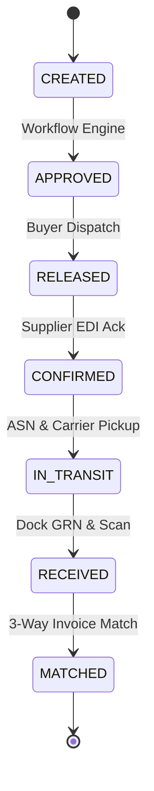

# ORION-9 AI SYNTHETIC ENTERPRISE DATA & LIVE-SIMULATION ENGINE SPECIFICATION
**System**: Orion-9 Supply Chain Operating System  
**Environment**: DEMO (Airgapped Sandbox / Firebase Demo Environment)  
**Generation Frequency**: Hourly (20 Complete Enterprise Ecosystem Packages / Batch)  
**Lifecycle Simulator**: Continuous Multi-Echelon Business Progression (1x, 5x, 20x, PAUSED)

---

## 1. Architectural Overview & Philosophy

In the Orion-9 Operating System, DEMO is **NOT** a superficial "demo UI" with hardcoded strings. The identical Orion-9 OS, Kernel, workflows, Control Tower, AI Workforce, Digital Twin, analytics, and business applications execute in DEMO mode exactly as they do in LIVE mode.

The sole distinction is the data source:
- **DEMO**: Fully functional Orion-9 + Synthetic AI-Generated Enterprise Ecosystems + Continuous Autonomous Business Simulation + Isolated Sandbox Firestore.
- **LIVE**: Fully functional Orion-9 + Real Multi-Tenant Enterprise Data + Authoritative Cloud Firestore (`orion9-dev-db-2026`).

```mermaid
flowchart TD
    subgraph Orion_OS [Single Orion-9 Operating System]
        Kernel[Kernel & Authorization Engine]
        SCM[SCM Business Modules]
        CT[Control Tower & Signal Engine]
        DT[Digital Twin & Scenario Simulator]
        AI[Governed AI Workforce & Copilot]
    end

    subgraph Environment_Router [Database Environment Control Plane]
        DBM[DatabaseConnectionManager]
    end

    subgraph DEMO_Mode [DEMO Operating Environment]
        DemoDB[(Isolated Demo Firestore)]
        SynthEngine[AI Synthetic Data Engine (20 Pkgs/hr)]
        SimEngine[Live Simulation Engine (1x/5x/20x)]
    end

    subgraph LIVE_Mode [LIVE Operating Environment]
        LiveDB[(Authoritative Cloud Firestore: orion9-dev-db-2026)]
        RealData[Real Enterprise Supply Chain Data]
    end

    Kernel --> DBM
    SCM --> DBM
    CT --> DBM
    DT --> DBM
    AI --> DBM

    DBM -- "Mode: DEMO" --> DemoDB
    DemoDB <--> SynthEngine
    DemoDB <--> SimEngine

    DBM -- "Mode: LIVE" --> LiveDB
    LiveDB <--> RealData
```

---

## 2. Synthetic Enterprise Package Composition (20 / Hour Target)

Every hour, `DemoSyntheticDataEngine` autonomously generates **20 complete enterprise ecosystems**. Each package is a relationally coherent mini-enterprise network:

| Component | Quantity / Pkg | Key Attributes & Relational Consistency |
| :--- | :--- | :--- |
| **Company** | 1 | Fictional enterprise name (e.g. *NovaCore Components*, *Vertex Industrial Systems*), tax profile, currency, region, risk tier, `environment: 'DEMO'`, `syntheticData: true`. |
| **Suppliers** | 2 – 3 | Tier 1 & Tier 2 suppliers, verified lead times (7–28d), ratings (80–100%), historical OTD scores (85–100%). |
| **Customers** | 1 – 2 | Strategic / Enterprise buyers with assigned credit limits ($100k–$500k) and payment terms (Net 45/60). |
| **Products (SKUs)** | 3 – 5 | Bill of materials entries, ABC classification, unit costs, selling prices, safety stock thresholds, reorder points. |
| **Warehouse Hubs**| 1 | Regional logistics distribution center with capacity utilization metrics (65–95%) and square footage. |
| **Purchase Orders**| 3 – 5 | PO numbers, line items with quantities, agreed pricing, and expected delivery dates. |
| **Shipments / ASNs**| 2 – 4 | Container freight with carrier tracking numbers (Maersk, DHL, DB Schenker), modes (AIR/OCEAN), milestones. |
| **Inventory** | 3 – 5 | Reconciled stock levels: $\text{OnHand} = \text{Available} + \text{Reserved}$, valuation $= \text{OnHand} \times \text{UnitCost}$. |
| **Invoices** | 1 – 3 | 3-Way matched invoices with PO line reference verification. |
| **Exceptions** | 0 – 2 | Controlled supply chain disruptions (customs hold, weather delay, price variance, stockout risk). |
| **Sensing Signals** | 1 | Early warning telemetry (meteorological alert, port congestion index, supplier credit flags). |

---

## 3. Mathematical & Relational Integrity Rules

To guarantee authentic operational realism, the engine enforces strict business invariants:
1. $\text{ASN Quantity} \le \text{PO Ordered Quantity}$
2. $\text{GRN Received Quantity} \le \text{ASN Quantity}$
3. $\text{Quantity Available} = \text{Quantity On Hand} - \text{Quantity Reserved}$
4. $\text{Total Invoice Amount} = \sum (\text{Line Ordered Qty} \times \text{Agreed Unit Price})$
5. Every record is indelibly stamped: `environment: 'DEMO'`, `syntheticData: true`, and `generationBatchId`.

---

## 4. Continuous Business Simulation Engine

The simulation engine (`DemoLiveSimulationEngine`) advances open synthetic business documents between hourly generation cycles:



### Configurable Simulation Speeds
- **`1x` (Real-Time)**: Normal cadence (1 cycle per minute).
- **`5x` (Fast)**: Accelerated testing (1 cycle every 12 seconds).
- **`20x` (Very Fast / Hyper)**: Interactive demo mode (1 cycle every 3 seconds).
- **`PAUSED`**: Halts automatic state progression.

### Empirical Exception Probabilities
- `transportDelayProbability`: Default 18% (Weather, customs, traffic).
- `supplierDelayProbability`: Default 15% (Factory lead time variance).
- `inventoryRiskProbability`: Default 12% (Buffer depletion, spike demand).
- `qualityIssueProbability`: Default 8% (Batch inspection quarantine).
- `invoiceMismatchProbability`: Default 5% (Disputed line item price).

---

## 5. Idempotency & Duplicate Protection

Every generation batch is assigned a unique, idempotent batch identifier:
$$\text{BatchID} = \text{DEMO-} \langle\text{YYYYMMDDTHH}\rangle \text{-BATCH-} \langle\text{RANDOM\_3DIGIT}\rangle$$

Before executing write operations, `DemoSyntheticDataEngine` checks if the `generationBatchId` has already been committed. Duplicate executions are automatically skipped without creating redundant records.

---

## 6. Governed Demo Data Reset

Administrators can purge synthetic demo records and restore a clean 20-package baseline dataset via the **Governed Demo Reset** protocol:
1. **Environment Gate**: If `dbManager.getEnvironment() !== 'DEMO'`, the reset operation is **IMMEDIATELY TERMINATED** with a hard exception.
2. **Authorization Gate**: Requires `isPlatformAdmin === true`.
3. **Confirmation Phrase**: Requires explicit typing of `RESET DEMO DATA`.
4. **Action**: Cleans synthetic documents and initializes 20 pristine enterprise ecosystems.
