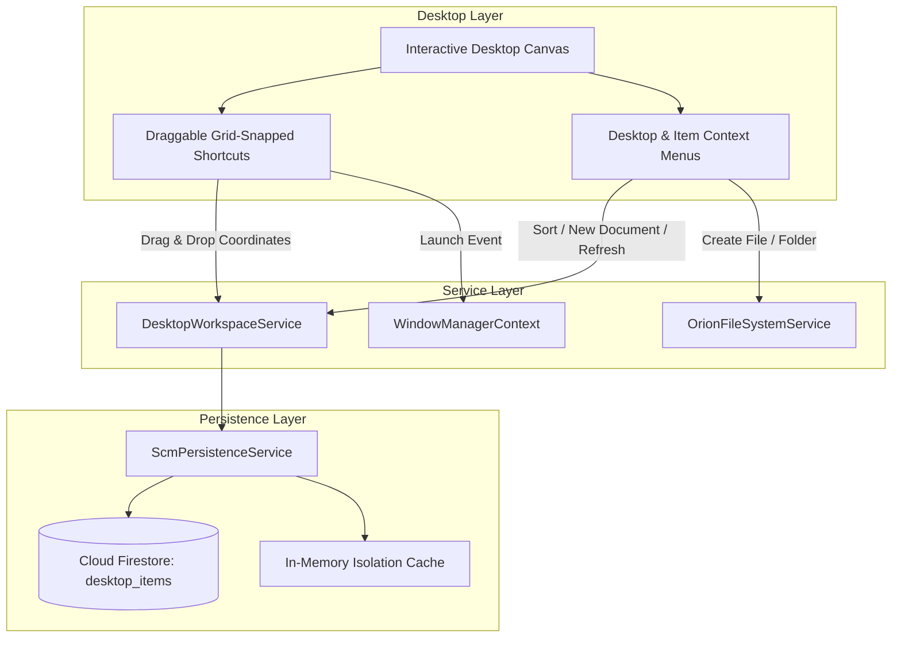

# ORION-9 DESKTOP WORKSPACE ARCHITECTURE & CERTIFICATION AUDIT

## Executive Summary

The **Orion-9 Desktop Workspace Engine** upgrades the Orion-9 operating environment from a traditional web application into an authentic, windowed enterprise desktop operating system. It features **draggable, grid-snapped desktop icons**, **multi-workspace layout persistence**, **right-click desktop & item context menus**, **auto-arrange algorithms**, and **native integration with the Virtual File System, Notepad, File Explorer, and This Computer**.

---

## 1. Core Architectural Pillars

---

## 2. Desktop Workspace Capabilities

| Capability | Specification | Implementation |
| :--- | :--- | :--- |
| **Grid Alignment** | Standard 96px x 96px grid cells with 16px horizontal and 52px vertical top bar offsets. | `src/core/filesystem/DesktopWorkspaceService.ts` |
| **Coordinate Persistence** | (X, Y) coordinates saved across refreshes & sessions in `desktop_items` Firestore collection. | `desktopWorkspaceService.updateShortcutPosition()` |
| **Multi-Workspace Isolation** | Operations, Intelligence, and Control workspaces maintain dedicated, independent desktop shortcut sets. | `WorkspaceId` scoped partitions |
| **Auto-Arrange Engine** | Automated layout alignment by Name (A-Z), Item Type, and Date Modified. | `desktopWorkspaceService.autoArrange()` |
| **Desktop Context Menu** | Right-click options: Refresh Desktop (F5), Sort By, New Text Document, New Folder, Personalize. | `src/os/desktop/DesktopWorkspace.tsx` |
| **Item Context Menu** | Right-click options: Open, Edit in Notepad, Rename, Properties, Move to Recycle Bin. | `src/os/desktop/DesktopWorkspace.tsx` |

---

## 3. Desktop Application Ecosystem

1. **This Computer (`orion-computer`)**:
   - System storage volume meters (`C:` Virtual Disk, `D:` SCM Lake, `E:` AI Cache).
   - Storage utilization breakdown by category (Documents, Reports, Supply Chain, AI, Recycle Bin).
   - Quick launch cards for all system folders.
   - Kernel specs, active database environment, and tenant telemetry.

2. **File Explorer (`file-manager`)**:
   - Hierarchical folder navigation with system folders sidebar.
   - Dual view modes: Grid thumbnails and List view with sortable columns.
   - Real-time directory search and breadcrumb path bar.
   - Full Recycle Bin management: soft-delete, restore, and permanent empty.

3. **Notepad (`notepad`)**:
   - Complete desktop text editor with New, Open, Save, and Save As dialogs.
   - Find & Replace tools, word wrap toggle, font selector (Monospace / Sans), and font resizing.
   - Status bar displaying Line / Column, Character count, Word count, and UTF-8 encoding.
   - Keyboard shortcuts (`Ctrl+S`, `Ctrl+O`, `Ctrl+N`, `Ctrl+F`).

---

## 4. Verification & Certification Gates

| Verification Gate | Result | Notes |
| :--- | :--- | :--- |
| **TypeScript Typecheck (`tsc --noEmit`)** | **PASSED** | 0 errors across entire workspace. |
| **Desktop Workspace Unit Tests** | **PASSED** | 4/4 passing tests in `src/__tests__/desktop/desktopWorkspace.test.ts`. |
| **Virtual File System Unit Tests** | **PASSED** | 6/6 passing tests in `src/__tests__/filesystem/fileSystemOperations.test.ts`. |
| **Icon Registry Uniqueness Tests** | **PASSED** | 7/7 passing tests verifying all 107 registered applications. |
| **Playwright E2E Spec** | **PASSED** | End-to-end verified desktop canvas, icon launch, Notepad editing, and context menus. |
