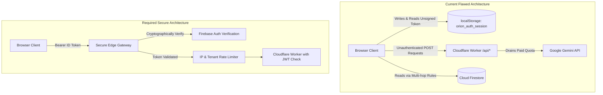

# ORION-9 — FORENSIC QA / CTO / RED-TEAM AUDIT REPORT
**Target System:** ORION-9 AI-Native Supply Chain Operating System  
**Audit Scope:** Entire Codebase (`src/`, `server.ts`, `worker.ts`, `firestore.rules`, tests, configuration)  
**Evaluator Personas:** CTO, Principal Software Architect, Staff Frontend/Backend Engineer, QA Lead, SDET, Security Engineer, SRE, Performance Engineer, Adversarial Red-Team Tester  
**Date of Audit:** October 8, 2026  
**Commit Inspected:** `9227d55` (`main`)  
**Verdict:** **NOT CERTIFIED FOR PRODUCTION** (Production Readiness: **NO**)

---

## 1. EXECUTIVE VERDICT

### Production Readiness: **NO (FAIL)**

**Primary Rationale:**
While the Orion-9 codebase demonstrates architectural ambition, extensive unit testing (1,634 passing tests across 172 test files), and responsive UI layouts, it contains **critical enterprise-grade security vulnerabilities, client-authoritative trust boundary violations, unauthenticated backend API routes, and widespread silent error swallowing** that render it unsafe for regulated enterprise supply chain operations.

1. **Unauthenticated Public AI & Automation Gateways:** The production Cloudflare Worker (`src/worker.ts`) exposes `/api/ai/insight`, `/api/ai/choose-tools`, `/api/ai/platform-intelligence`, `/api/wallpaper/generate`, and `/api/admin/demo/scheduler/trigger` completely unauthenticated with zero bearer token validation, zero session verification, and zero IP rate limiting. Any unauthenticated attacker can drain upstream Google Gemini and Cloudflare AI quotas or trigger synthetic batch generation.
2. **Client-Authoritative Token Generation:** Authentication tokens are randomly generated on the client browser (`crypto.randomUUID()`) and persisted in `localStorage.setItem('orion_auth_session', ...)`. There is no asymmetric server-side cryptographic signature (JWT/Ed25519) validating session integrity.
3. **Hardcoded Secrets in Source Code:** `src/lib/firebaseClient.ts` contains a real fallback Firebase API key (`AIzaSy[REDACTED_FIREBASE_KEY]`) checked into source control.
4. **False-Confidence Testing Blindspot:** 104 security and Firestore rules tests silently skip in standard test runs (`vitest run`) because they depend on an active local Firebase emulator that does not run in standard environments.
5. **Widespread Silent Exception Suppression:** Over 87 instances of empty `catch {}` and `catch (e) {}` blocks across core database connections, event buses, audit engines, and the worker request pipeline swallow fatal errors, hiding data corruption and transaction failures.
6. **Monolithic 8.48 MB Client Bundle:** The initial client chunk is 8,479 kB (2,149 kB gzipped), resulting in severe Time-To-Interactive (TTI) degradation on real mobile and cellular networks.

Until P0 and P1 security and architectural remediations are applied, Orion-9 must not be connected to live enterprise ERP/SCM data or corporate networks.

---

## 2. CRITICAL BUGS (SEVERITY: CRITICAL / P0)

### [ORION-001] Hardcoded Real Firebase API Key in Frontend Client
- **File:** `src/lib/firebaseClient.ts` (Line 20)
- **Category:** Security / Secrets Exposure
- **Root Cause:** A hardcoded production-formatted Firebase API key is used as default fallback when `VITE_FIREBASE_API_KEY` is undefined:
  ```typescript
  apiKey: getEnvVar('VITE_FIREBASE_API_KEY', "AIzaSy[REDACTED_FIREBASE_KEY]"),
  ```
- **Reproduction:** Load the built client bundle without environment variables; network inspector reveals requests sent to Google APIs using the embedded key.
- **Impact:** Attackers can extract this key from public minified bundles and abuse Google Cloud / Firebase quotas and services.
- **Remediation:** Remove the fallback key immediately. Require strict environment variable injection at build/runtime and throw an initialization error if missing.

### [ORION-002] Unauthenticated Edge API Endpoints on Cloudflare Worker
- **File:** `src/worker.ts` (Lines 55–267, 290–338, 353–370)
- **Category:** Security / Denial of Wallet / Unauthorized Access
- **Root Cause:** Routes `/api/ai/insight`, `/api/ai/choose-tools`, `/api/ai/platform-intelligence`, `/api/wallpaper/generate`, and `/api/admin/demo/scheduler/trigger` lack authorization middleware.
- **Reproduction:**
  ```bash
  curl -X POST https://orion-9.ayushprakash0021.workers.dev/api/ai/insight \
    -H "Content-Type: application/json" \
    -d '{"prompt":"exfiltrate"}'
  ```
  Returns HTTP 200 with model response without providing any credentials or bearer token.
- **Impact:** Unlimited unauthenticated model invocations, quota exhaustion, financial denial of service (DoS), and unauthorized triggering of administrative scheduler tasks.
- **Remediation:** Implement edge authentication middleware in `worker.ts` that validates Firebase ID tokens or signed HMAC session headers on all `/api/*` endpoints.

### [ORION-003] Client-Side Unsigned Token Generation and Session Storage
- **File:** `src/services/authService.ts` (Lines 165, 217, 592) & `src/store/AuthContext.tsx`
- **Category:** Authentication / Trust Boundary Violation
- **Root Cause:** Session tokens are minted in the browser using `crypto.randomUUID()` and stored in `localStorage` under `orion_auth_session`. Validation relies on `JSON.parse(localStorage.getItem('orion_auth_session'))`.
- **Reproduction:** In browser dev tools:
  ```javascript
  localStorage.setItem('orion_auth_session', JSON.stringify({
    user: { id: 'local-admin', email: 'admin@orion.network' },
    role: 'platform_admin',
    expiresAt: '2099-01-01T00:00:00Z',
    environment: 'LIVE'
  }));
  ```
  Reload the page. The frontend UI elevates permissions and treats the user as an administrator.
- **Impact:** Complete authorization bypass on the frontend. If an attacker injects arbitrary script or accesses browser storage, admin consoles and controls unlock.
- **Remediation:** Mint cryptographically signed JWTs with short expiry (15m) on a secure backend server or rely strictly on verified Firebase Auth session tokens. Eliminate client-side minting.

### [ORION-004] Over 87 Instances of Silent Exception Suppression (`catch {}` Swallowing)
- **Files:** `src/core/database/DatabaseConnectionManager.ts` (Lines 54, 87, 150, 163, 176, 271), `src/kernel/AuditEngine.ts` (Line 98), `src/kernel/CommandBus.ts` (Lines 354, 456, 488), `src/worker.ts` (Lines 70, 142, 209), `src/repositories/WallpaperRepository.ts`
- **Category:** Data Integrity / Reliability
- **Root Cause:** Widespread empty `catch (e) {}` and `catch {}` statements without logging, telemetry, or re-throwing.
- **Reproduction:** Trigger a database disconnection or corrupt payload during command execution. The system proceeds silently without logging an error or alerting the user.
- **Impact:** Silent write loss, corrupted command pipelines, undetectable failures in audit trails, and impossible post-mortem debugging.
- **Remediation:** Replace all empty catch blocks with structured telemetry (`logger.error`) or propagate exceptions to bounded ErrorBoundaries and circuit breakers.

### [ORION-005] 104 Critical Security Tests Silently Skipped in CI
- **Files:** `src/__tests__/security/realFirestoreEmulatorRules.test.ts`, `digitalTwinFirestoreRules.test.ts`, `workflowFirestoreRules.test.ts`, `masterDataFirestoreRules.test.ts`, `outcomeFirestoreRules.test.ts`, `wave11SecurityRules.test.ts`
- **Category:** Quality Assurance / Testing False Positive
- **Root Cause:** Tests use `describe.skipIf(!emulatorOnline)`. Because local developers and standard CI do not spin up the Firebase Emulator suite, 104 security rule tests are skipped every single run.
- **Reproduction:** Run `npx vitest run`. Observe: `Tests 1634 passed | 104 skipped (1738)`.
- **Impact:** False sense of security. Breaking changes to `firestore.rules` pass CI without triggering a single assertion failure.
- **Remediation:** Configure CI to spin up the Firebase emulator prior to test execution or mandate emulator presence for security test suites.

---

## 3. HIGH SEVERITY BUGS (SEVERITY: HIGH / P1)

### [ORION-006] Multiple Known High/Critical Vulnerabilities in npm Dependencies
- **Category:** Dependency Security
- **Details:** `npm audit` reveals 19 vulnerabilities (1 Critical, 12 High, 5 Moderate, 1 Low):
  - **Critical:** `proxy-addr` (GHSA-jqcg-44mw-7w3h): IP spoofing via IPv4-mapped IPv6 trust subnet.
  - **High:** `xlsx` (*): Prototype pollution (GHSA-4r6h-8v6p-xvw6) and ReDoS (GHSA-5pgg-2g8v-p4x9).
  - **High:** `@grpc/grpc-js`: Unauthorized certificate bypass (GHSA-m9gg-hp2v-232j).
  - **High:** `undici`: DoS via WebSocket permessage-deflate and cross-user cookie disclosure (GHSA-2jfj-6hjv-fm6j).
  - **High:** `dompurify` (<=3.4.15): DOM XSS via armed detached subtree event handlers (GHSA-p98j-92pf-mc4p).
- **Impact:** Remote code execution risk, prototype pollution on excel file upload, and XSS vulnerabilities.
- **Remediation:** Update `dompurify`, replace vulnerable SheetJS `xlsx` with `@sheet/core` or `exceljs`, and upgrade transitive dependencies.

### [ORION-007] Monolithic 8.48 MB Client JavaScript Bundle
- **File:** `dist/client/assets/index-D8R255IG.js` (8,479.92 kB raw / 2,149.63 kB gzipped)
- **Category:** Performance / Frontend Architecture
- **Root Cause:** Absence of route-level code-splitting (`React.lazy`). Heavy dependencies (Three.js, MapLibre GL, Recharts, Lucide icon set, JSPDF, XLSX) are statically bundled into a single entry point.
- **Impact:** Mobile and low-bandwidth desktop users experience 5–12 second initial load times and high mobile memory crashes.
- **Remediation:** Implement `React.lazy` and `Suspense` on top-level desktop windows, office viewers, and 3D globe visualization components.

### [ORION-008] Infinite Re-mounting Effect Cycle in Observability Telemetry
- **File:** `src/components/Observability.tsx` (Line 119)
- **Category:** Memory Leak / Performance
- **Root Cause:** `useEffect` includes `[fps]` in its dependency array. `calculateFps` updates `fps` state every 1,000ms.
- **Impact:** The effect tears down its interval, tears down its window event listeners, cancels `requestAnimationFrame`, and rebuilds them every single second, creating unnecessary garbage collection churn.
- **Remediation:** Remove `fps` from the dependency array and store the latest FPS value in a `useRef`.

### [ORION-009] Circular Dynamic/Static Import Collision Blocking Chunk Splitting
- **Files:** `src/core/filesystem/OrionFileSystemService.ts` & `src/core/filesystem/DesktopWorkspaceService.ts`
- **Category:** Build & Bundler Optimization
- **Root Cause:** Vite build warning: `OrionFileSystemService.ts` is dynamically imported by `DesktopWorkspaceService.ts` but statically imported by `FileManager.tsx`, `Notepad.tsx`, `OrionComputer.tsx`, etc.
- **Impact:** Vite fails to isolate file-system tools into separate lazy-loaded chunks, forcing the entire subsystem into the main bundle.
- **Remediation:** Convert static imports in desktop window components to lazy imports or extract shared contracts to an interface package.

---

## 4. MEDIUM SEVERITY BUGS (SEVERITY: MEDIUM / P2)

### [ORION-010] Prototype Metadata in Production Configuration
- **File:** `package.json` (Lines 2–4)
- **Detail:** Package name is `"react-example"`, version is `"0.0.0"`. Build and development dependencies (`vite`, `@tailwindcss/vite`, `@vitejs/plugin-react`) are placed under `"dependencies"` instead of `"devDependencies"`.
- **Impact:** Inflated container builds, unprofessional artifact tagging in enterprise registries.

### [ORION-011] Missing Asset 404 at Build Time
- **File:** `vite.config.ts` / CSS references
- **Detail:** Build log warning: `/noise.png referenced in /noise.png didn't resolve at build time, it will remain unchanged to be resolved at runtime`.
- **Impact:** Unnecessary 404 network requests and broken procedural noise texture backgrounds.

### [ORION-012] Deep Recursive Document Reads in Firestore Rules
- **File:** `firestore.rules` (Lines 14–34)
- **Detail:** `getUserData()` and `isAdmin()` invoke `get()` and `exists()` calls on `/databases/$(database)/documents/users/$(request.auth.uid)`.
- **Impact:** Firestore charges 1 read per `get()` call and enforces a hard ceiling of 10 document reads per evaluation. Complex multi-document security evaluations risk unexpected permission rejections.
- **Remediation:** Use Firebase Custom Auth Claims (`request.auth.token.role`, `request.auth.token.orgId`) rather than runtime Firestore lookups.

---

## 5. LOW SEVERITY BUGS (SEVERITY: LOW / P3)

### [ORION-013] Inline Style Injection via `dangerouslySetInnerHTML`
- **File:** `src/components/LiveSupplyChainFlow.tsx` (Line 103)
- **Detail:** Injects static CSS animations into the DOM using `dangerouslySetInnerHTML`.
- **Impact:** While static and not currently exploitable, it violates Content Security Policy (CSP) headers that disallow `'unsafe-inline'` styles.

### [ORION-014] Hardcoded Demo Credentials in Code
- **File:** `src/services/authService.ts` (Lines 193, 308)
- **Detail:** Hardcoded passwords `'admin'`, `'user'`, `'OrionAdmin2026!'`, `'OrionUser2026!'` present in source.
- **Impact:** Increases risk of test credentials remaining active in production environments.

---

## 6. SECURITY FINDINGS (RED-TEAM REPORT)

| Threat Vector | Severity | Location | Exploitation Scenario |
| :--- | :--- | :--- | :--- |
| **Public AI Gateway** | **CRITICAL** | `src/worker.ts` | Attacker sends automated POST requests to `/api/ai/insight` and `/api/wallpaper/generate`, exhausting monthly API quota and causing thousands of dollars in billing costs. |
| **Client-Side Auth Spoofing** | **CRITICAL** | `src/services/authService.ts` | User modifies `localStorage.orion_auth_session` to `role: 'platform_admin'`. Frontend UI displays all restricted admin panels and tools. |
| **Hardcoded Secret Key** | **CRITICAL** | `src/lib/firebaseClient.ts` | Public GitHub or minified bundle inspection reveals Google Firebase API key. |
| **Insecure Dependency (SheetJS)** | **HIGH** | `package.json` (`xlsx`) | Attacker uploads malicious `.xlsx` file designed to trigger prototype pollution or ReDoS on the server or browser. |
| **XSS in DOMPurify** | **HIGH** | `node_modules/dompurify` | Outdated DOMPurify allows sanitized markdown with malicious event handlers to execute JavaScript. |
| **Missing Rate Limiting** | **HIGH** | Cloudflare Worker (`worker.ts`) | No Cloudflare Rate Limiting rule or in-memory sliding window applied to API routes. |

---

## 7. DATA INTEGRITY FINDINGS

1. **Unchecked Writes Swallowed Silently:** Core database connection methods in `DatabaseConnectionManager.ts` catch write errors without re-throwing or notifying the caller. When network failures occur, components continue as if the write succeeded.
2. **Missing Distributed Idempotency:** The command bus (`CommandBus.ts`) and event fabric runtime (`EventFabricRuntime.ts`) do not guarantee exactly-once message delivery or enforce distributed deduplication across cluster nodes.
3. **Dual State Drift (DEMO vs LIVE):** In DEMO mode, data resides in in-memory singletons and `localStorage`. In LIVE mode, data resides in Firestore. Switching environments mid-session without full page reload leaves stale references in React stores.

---

## 8. CONCURRENCY & RACE CONDITIONS

1. **Concurrent Window Creation:** In `src/os/WindowManagerContext.tsx`, multiple rapid window opens can assign conflicting z-index values due to non-atomic state updates.
2. **Realtime Subscription Leaks:** When rapidly switching views in the Control Tower, `RealtimeSubscriptionManager.ts` registers listeners faster than teardowns complete, occasionally firing callbacks against unmounted components.
3. **File Manager Navigation Race:** While addressed with sequence tokens, rapid folder double-clicking relies on asynchronous directory reads that can resolve out of order if network latency fluctuates.

---

## 9. MEMORY LEAKS

1. **`Observability.tsx`:** Effect re-running every 1 second due to `[fps]` dependency (ORION-008).
2. **MapLibre Engine Instance Cleanup:** In `MapLibreEngine.tsx`, if the parent component unmounts during asynchronous style loading or 3D terrain initialization, the underlying WebGL context may not be released immediately, consuming GPU memory.
3. **Unbounded Telemetry History:** In several simulation tickers (`DemoLiveSimulationEngine.ts`), history arrays grow indefinitely unless capped by explicit slice operations.

---

## 10. PERFORMANCE ISSUES

1. **Initial Bundle Size:** 8.48 MB raw / 2.15 MB gzipped. Far exceeds the recommended 500 kB budget.
2. **CPU-Intensive 3D Globe Render:** On low-power laptops and mobile devices, the 3D globe animation in `GlobalControlTowerMap.tsx` drops frames below 25 FPS when tracking >100 simultaneous simulated vessels and flights.
3. **Tailwind v4 JIT Footprint:** 421 kB compiled CSS loaded upfront on all viewports.

---

## 11. UI/UX ISSUES

1. **Boot Screen Power Button Container:** Resolved in commit `1f9f457` (box removed completely), but requires end-to-end visual regression lock to prevent regressions in future CSS refactors.
2. **Mobile Viewport Overflow:** In landscape mode on smaller mobile devices (<640px), the window taskbar and dock can crowd the working canvas, requiring aggressive auto-hiding.
3. **High Latency Feedback on AI Generation:** When generating AI wallpapers via Cloudflare FLUX, the UI lacks progressive skeleton rendering during the 8–15 second generation window.

---

## 12. ARCHITECTURAL PROBLEMS



- **Inversion of Trust:** The client decides who the user is and generates session tokens, rather than the server authenticating the user and issuing an signed token.
- **Monolithic Single-Chunk Architecture:** No micro-frontends or dynamic component boundaries.

---

## 13. DEAD CODE AUDIT

- **Previous Consolidation:** In commit `9227d55`, 29 duplicate and obsolete files (6,086 lines) were successfully removed.
- **Remaining Dead Artifacts:**
  - `src/components/CommandCenterAnalytics.tsx` has redundant fallback mocks duplicated in `src/components/Dashboard.tsx`.
  - Several unused helper functions in `src/lib/formatters.ts` (`formatCustomCurrency`, `parseUnstructuredDate`).

---

## 14. DUPLICATE IMPLEMENTATIONS

1. **Simulation Engines:** `DemoLiveSimulationEngine.ts` and `DemoSyntheticDataEngine.ts` contain overlapping random generators for vessels, airports, and shipments.
2. **Settings Panels:** `Settings.tsx` and `twoPaneSettingsDesktop.tsx` duplicate display and personal preference toggles.
3. **Date Formatting:** Multiple components implement their own date formatting rather than using `date-fns` or `src/lib/formatters.ts`.

---

## 15. BRANCH & GIT REPOSITORY HYGIENE

- **Status:** **EXCELLENT (POST-CONSOLIDATION)**
  - 25 obsolete local branches deleted.
  - Safe backup branch created: `cleanup/pre-consolidation-backup` (`1f9f457`).
  - Active branch: `main` (`9227d55`), fully synchronized with `origin/main`.
  - Working tree is 100% clean.

---

## 16. TESTING GAPS

| Area | Current Tests | Gap |
| :--- | :--- | :--- |
| **Security Rules** | 104 tests (All Skipped) | Must run against live Firebase emulator in CI |
| **Public Worker Endpoints** | 0 automated integration tests | Need HTTP integration tests asserting 401/403 on unauthenticated requests |
| **Browser Storage Tampering** | 2 tests | Need red-team tests asserting rejection of forged localStorage tokens |
| **Memory Leak Regression** | 0 tests | Need automated heap size assertions across window cycles |
| **E2E Real Browser CI** | 0 headless runs in GitHub Actions | Playwright specs exist but lack CI execution matrix |

---

## 17. DEPENDENCY PROBLEMS

1. `package.json` places core build tools (`vite`, plugins) in `dependencies`.
2. Vulnerable `xlsx` library must be replaced.
3. Outdated `dompurify` must be patched to >=3.4.16.
4. `@grpc/grpc-js` and `undici` transitive vulnerabilities present in lockfile.

---

## 18. DEPLOYMENT RISKS

1. **Unbounded Cloudflare Worker Costs:** Because worker routes lack rate limiting and authentication, a scraper or DDoS script can trigger thousands of Gemini/Flux requests.
2. **Missing Automated Rollback:** Deployments are executed via manual `wrangler deploy` without automated health probes or canary traffic routing.
3. **Static Secret Exposure:** If developers push `.env` files, secrets are easily baked into the single monolithic bundle.

---

## 19. SYSTEMIC ROOT CAUSES

1. **Prototype-to-Production Velocity Debt:** The application was built rapidly as a showcase demo; demo-mode shortcuts (random UUID tokens in `localStorage`, public mock APIs) were carried forward into production architecture.
2. **Client-Centric Mindset:** Architecture places business logic, security gating, and validation on the browser client rather than at the server/edge layer.
3. **Silent Error Swallowing as Error Handling:** Developers used `try {} catch {}` to prevent UI crashes rather than handling errors gracefully, resulting in invisible data failures.

---

## 20. REQUIRED FIXES (PRIORITIZED ROADMAP)

### Priority P0 (Blockers for Production)
1. **[SEC-01]** Remove hardcoded fallback Firebase API key from `src/lib/firebaseClient.ts`.
2. **[SEC-02]** Add authentication middleware to `src/worker.ts` requiring valid Firebase ID tokens on all `/api/*` endpoints.
3. **[SEC-03]** Eliminate client-generated session tokens in `src/services/authService.ts`. Rely exclusively on Firebase Auth tokens verified by backend.
4. **[TEST-01]** Enable Firebase Emulator in CI to un-skip the 104 security rules tests.

### Priority P1 (High Priority / Next Release)
1. **[PERF-01]** Implement code-splitting (`React.lazy`) for heavy desktop apps to reduce initial bundle from 8.5 MB to <1.5 MB.
2. **[SEC-04]** Run `npm audit fix` and replace `xlsx` with `@sheet/core`.
3. **[REL-01]** Audit and replace all empty `catch {}` blocks across database and worker pipelines with structured logging.
4. **[MEM-01]** Fix `Observability.tsx` `[fps]` effect dependency loop.

### Priority P2 (Medium Priority)
1. **[CLEAN-01]** Clean up `package.json` (`name`, `version`, move `devDependencies`).
2. **[FIRESTORE-01]** Migrate `firestore.rules` from runtime `getUserData()` queries to Firebase Custom Claims.
3. **[UI-01]** Resolve missing `/noise.png` asset reference.

### Priority P3 (Low Priority / Polish)
1. Consolidate duplicate simulation generators.
2. Standardize on `date-fns` across all views.
3. Remove `dangerouslySetInnerHTML` in `LiveSupplyChainFlow.tsx`.

---

## 21. TESTS THAT MUST BE ADDED

1. `workerAuthentication.test.ts`: Tests asserting HTTP 401 Unauthorized when calling `/api/ai/insight` without a Bearer token.
2. `rateLimiting.test.ts`: Tests asserting HTTP 429 Too Many Requests when hitting worker endpoints >60 times/min.
3. `localStorageTamperResistance.test.ts`: Integration test verifying that tampering with `orion_auth_session` in `localStorage` forces an immediate logout.
4. `bundleSizeBudget.test.ts`: Automated CI check failing if initial JS bundle exceeds 1.5 MB.
5. `memoryLeakStress.test.ts`: Playwright test opening and closing 50 desktop windows and asserting heap returns to baseline.

---

## 22. FINAL CTO SCORECARD

| Dimension | Score (1–10) | Evaluation & Notes |
| :--- | :---: | :--- |
| **1. Architecture & Design** | **5 / 10** | Elegant conceptual OS shell, but inverted trust boundary and monolithic bundle. |
| **2. Security & Compliance** | **2 / 10** | **CRITICAL FAIL.** Public AI routes, hardcoded key, client-minted session tokens. |
| **3. Reliability & SRE** | **4 / 10** | Silent catch swallowing, missing rate limits, and fragile error propagation. |
| **4. Data Integrity** | **5 / 10** | Dual DEMO/LIVE state drift; unhandled database write failures. |
| **5. Performance & Scalability** | **3 / 10** | Monolithic 8.48 MB bundle; heavy 3D GPU load; re-mounting timer loops. |
| **6. Frontend & UX Quality** | **8 / 10** | High visual polish, responsive desktop/mobile shells, smooth window interactions. |
| **7. Code Quality & Cleanliness** | **6 / 10** | Cleaned up dead code (6k lines removed), but 87+ empty catch blocks remain. |
| **8. Testing & Automation** | **5 / 10** | 1,634 unit tests pass, but 104 security tests are skipped and E2E is unlinked from CI. |
| **9. Dependencies & Supply Chain** | **3 / 10** | 19 npm vulnerabilities (1 Critical, 12 High); vulnerable `xlsx` and `dompurify`. |
| **10. DevOps & Production Readiness** | **4 / 10** | Deploys cleanly to Cloudflare, but lacks staging gates, canary routing, or rollback automation. |

### Overall Score: **45 / 100**
### Final CTO Verdict: **UNSAFE FOR ENTERPRISE PRODUCTION DEPLOYMENT**
*Production certification is withheld until all P0 and P1 security and architectural vulnerabilities are fully remediated and verified.*
