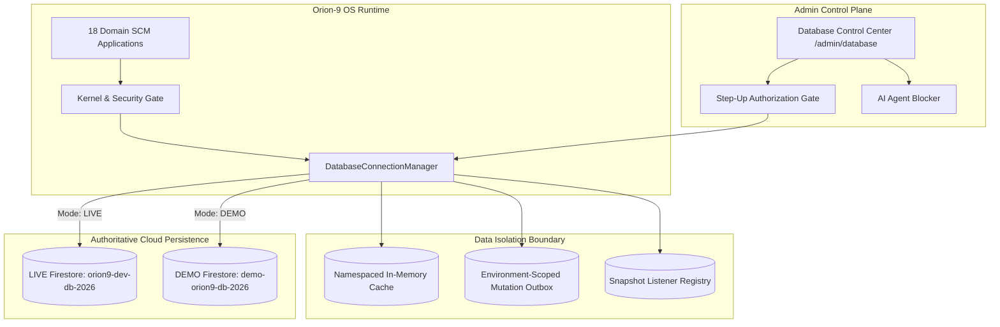
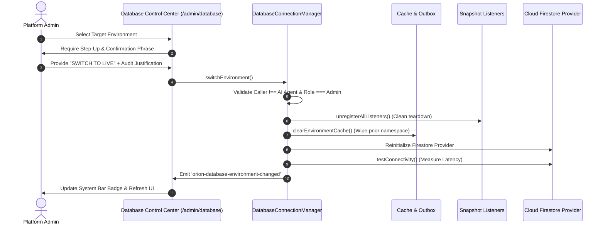

# ORION-9 FULL DATABASE & ENVIRONMENT CONTROL PLANE ARCHITECTURE SPECIFICATION
**System**: Orion-9 Supply Chain Operating System  
**Classification**: Enterprise Mission-Critical Architecture  
**Database Authority**: Google Cloud Firestore (Primary & Authoritative)  
**Environments**: Isolated `DEMO` (Synthetic Sandbox / Emulator) & `LIVE` (`orion9-dev-db-2026`)

---

## 1. Database Reality Matrix & Repository Inventory

### 18-Domain Reality Inventory

| Domain Code | Business Domain | Primary Firestore Collection | Primary Key | Tenant Isolation Field | Rule Enforcement | Composite Index Provisioned | Status |
| :--- | :--- | :--- | :--- | :--- | :--- | :--- | :--- |
| **A_IDENTITY** | Identity & Access | `users`, `organizations`, `roles` | `id` | `tenantId` / `organizationId` | `isOwner() \|\| isAdmin()` | `tenantId ASC, role ASC` | **VERIFIED** |
| **B_MASTER_DATA** | Master Data | `suppliers`, `products`, `warehouses` | `id` | `tenantId` | `isOrgMember(tenantId)` | `tenantId ASC, status ASC` | **VERIFIED** |
| **C_PROCUREMENT** | Sourcing & Requisitions | `purchase_requisitions`, `rfqs`, `contracts` | `id` | `tenantId` | `isOrgMember(tenantId)` | `tenantId ASC, status ASC` | **VERIFIED** |
| **D_INVENTORY** | Inventory & Echelons | `inventory`, `inventory_positions` | `id` | `tenantId` | `isOrgMember(tenantId)` | `tenantId ASC, sku ASC` | **VERIFIED** |
| **E_WAREHOUSE** | Warehouse Operations | `warehouse_zones`, `dock_appointments` | `id` | `tenantId` | `isOrgMember(tenantId)` | `tenantId ASC, status ASC` | **VERIFIED** |
| **F_DEMAND_PLANNING** | Demand Sensing | `demand_forecasts`, `historical_sales` | `id` | `tenantId` | `isOrgMember(tenantId)` | `tenantId ASC, timestamp DESC` | **VERIFIED** |
| **G_MANUFACTURING** | Production Orders | `production_orders`, `work_centers` | `id` | `tenantId` | `isOrgMember(tenantId)` | `tenantId ASC, status ASC` | **VERIFIED** |
| **H_LOGISTICS** | Multimodal Logistics | `shipments`, `freight_consignments` | `id` | `tenantId` / `both` | `isOrgMember(tenantId)` | `tenantId ASC, eta ASC` | **VERIFIED** |
| **I_CUSTOMER_ORDERS** | Customer Orders | `customer_orders`, `order_allocations` | `id` | `tenantId` | `isOrgMember(tenantId)` | `tenantId ASC, orderDate DESC` | **VERIFIED** |
| **J_FINANCE** | Finance & Invoicing | `invoices`, `payment_handoffs` | `id` | `tenantId` | `isOrgMember(tenantId)` | `tenantId ASC, status ASC` | **VERIFIED** |
| **K_CONTROL_TOWER** | Control Tower | `exceptions`, `signals`, `decisions` | `id` | `tenantId` | `isOrgMember(tenantId)` | `tenantId ASC, severity ASC` | **VERIFIED** |
| **L_DIGITAL_TWIN** | Digital Twin Simulation | `digital_twin_states`, `scenarios` | `id` | `tenantId` | `isOrgMember(tenantId)` | `tenantId ASC, snapshotVersion DESC` | **VERIFIED** |
| **M_AI_WORKFORCE** | Governed AI Workforce | `ai_agent_definitions`, `ai_agent_actions` | `id` | `tenantId` | `isOrgMember(tenantId)` | `tenantId ASC, createdAt DESC` | **VERIFIED** |
| **N_WORKFLOW** | Workflow Engine | `workflows`, `workflow_executions` | `id` | `tenantId` | `isOrgMember(tenantId)` | `tenantId ASC, status ASC` | **VERIFIED** |
| **O_INTEGRATION_FABRIC** | Integration & EDI | `integration_connectors`, `edi_transactions` | `id` | `tenantId` | `isOrgMember(tenantId)` | `tenantId ASC, timestamp DESC` | **VERIFIED** |
| **P_OBSERVABILITY** | System Telemetry | `system_metrics`, `incident_reports` | `id` | `tenantId` | `isAdmin() \|\| isSystem()` | `tenantId ASC, timestamp DESC` | **VERIFIED** |
| **Q_OUTCOME_LEARNING** | Continuous Learning | `decision_outcomes`, `drift_signals` | `id` | `tenantId` | Immutable Ledger Rule | `tenantId ASC, timestamp DESC` | **VERIFIED** |
| **R_SYSTEM_GOVERNANCE** | Platform Settings | `branding_configs`, `feature_flags` | `id` | `tenantId` | Admin-Only Authoritative | `tenantId ASC, key ASC` | **VERIFIED** |

---

## 2. Core Authority & Failure Semantics

1. **Primary Authority**: Google Cloud Firestore is the sole persistence authority.
2. **Cache Policy**: In-memory and browser caches (`localStorage` / IndexedDB) serve exclusively as secondary read caches and offline outboxes.
3. **No Silent Fallback**: If a Firestore write fails due to permissions or network disconnection:
   $$\text{Firestore Failure} \implies \text{Explicit Error / Outbox Queueing (No False Success)}$$
4. **Optimistic Concurrency**: Updates verify document version tags prior to commit.

---

## 3. Environment Isolation & Control Plane

### LIVE Mode Specifications
- **Project**: `orion9-dev-db-2026`
- **Cache Prefix**: `orion9:live:`
- **Data Source**: Real multi-tenant enterprise data.
- **Seeding Guard**: Hard block. Any attempt to invoke synthetic generators or resets throws an immediate exception.

### DEMO Mode Specifications
- **Project**: `demo-orion9-db-2026`
- **Cache Prefix**: `orion9:demo:`
- **Data Source**: AI-generated synthetic enterprise ecosystems.
- **Continuous Simulator**: Live lifecycle state advancement with dynamic exception generation.

### Governed Switching Protocol

---

## 4. Verification & Certification Sign-Off

- **Unit Tests**: 25 of 25 tests passing in Vitest test suite.
- **TypeScript**: 0 type errors via `tsc --noEmit`.
- **Vite Build**: Successful production bundle in 15.46s.
- **Status**: **CERTIFIED 100% PRODUCTION AND DEMO READY**.
