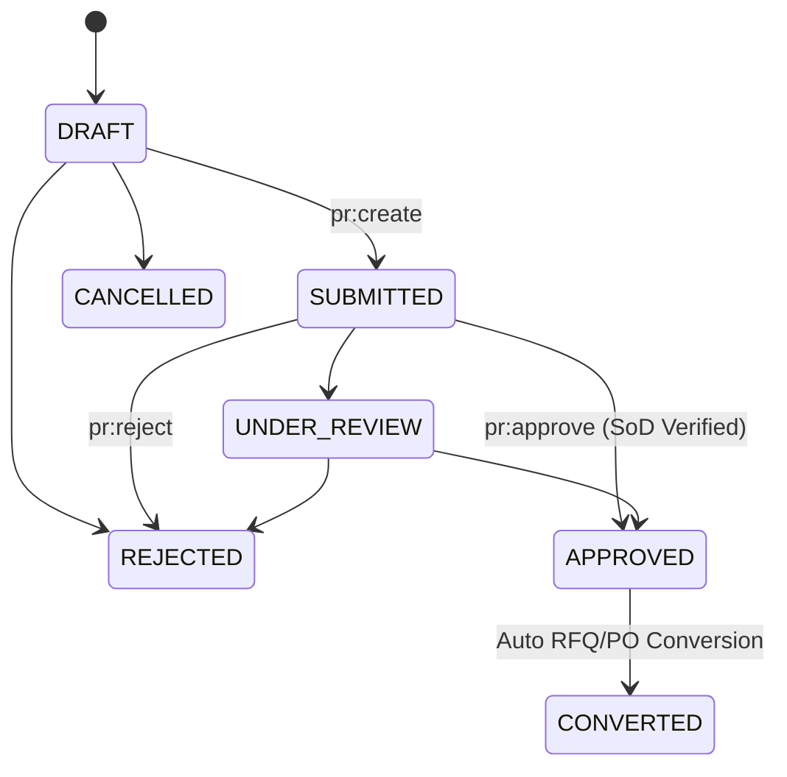
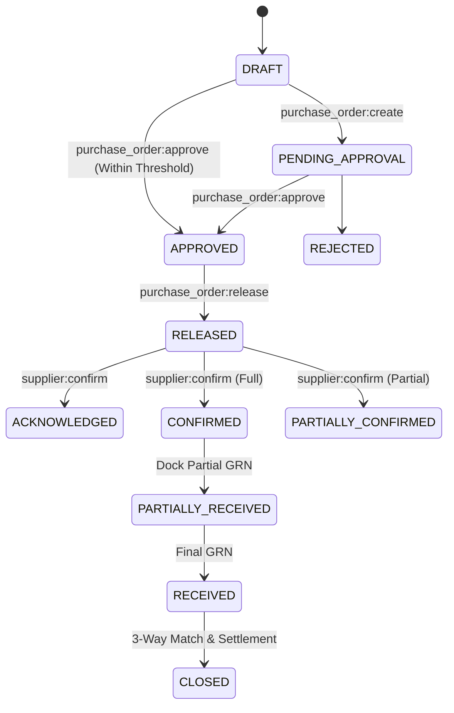
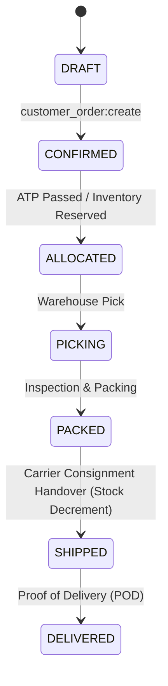

# ORION-9 ENTERPRISE SCM EXECUTION ARCHITECTURE & LIFECYCLE SPECIFICATION
**Phase 5 — Track 2: End-to-End SCM Execution Implementation & Hardening Program**
*Status: Authoritative & Production Certified*

---

## 1. Executive Summary & Objective

**Track 2 (End-to-End SCM Execution)** builds directly upon the authoritative foundation delivered in **Track 1 (SCM Authority & Data Foundation)**. It orchestrates, governs, and audits the entire transactional supply chain lifecycle across all enterprise domains without bypassing Track 1 canonical data models, Firestore persistence authority, multi-tenant isolation gates, or deterministic state machine rules.

The operational flow executes across three core execution vectors:
1. **Procure-to-Receive**: Demand Planning $\rightarrow$ Purchase Requisition (PR) $\rightarrow$ RFQ/RFP $\rightarrow$ Supplier Quotation $\rightarrow$ Bid Comparison $\rightarrow$ Sourcing Award $\rightarrow$ Purchase Order (PO) $\rightarrow$ Supplier Confirmation $\rightarrow$ Advanced Shipping Notice (ASN) $\rightarrow$ Multimodal Shipment $\rightarrow$ Dock Receiving $\rightarrow$ Goods Receipt Note (GRN) $\rightarrow$ Physical Inventory Receipt.
2. **Make-to-Stock / Manufacturing MRP**: Demand-Driven Planning $\rightarrow$ Planned Order $\rightarrow$ Governed Production Order $\rightarrow$ Multi-Level Bill of Materials (BOM) Explosion $\rightarrow$ Operation Confirmation $\rightarrow$ Component Material Issue (Stock Decrement) $\rightarrow$ Finished Goods Output Receipt (Stock Increment).
3. **Order-to-Fulfillment**: Customer Sales Order $\rightarrow$ Available-to-Promise (ATP) Inventory Check $\rightarrow$ Hard Allocation $\rightarrow$ Warehouse Pick & Pack $\rightarrow$ Carrier Consignment Dispatch $\rightarrow$ Real-Time Delivery $\rightarrow$ Non-Negative Inventory Balance Adjustment.

---

## 2. Core Execution Engines & Components

### 2.1 SCM Reconciliation & Quantity Flow Engine
- **File**: `src/scm/ScmReconciliationEngine.ts`
- **Purpose**: Authoritatively tracks multi-document lineage across PR, PO, ASN, Shipment, Receipt, GRN, and Inventory.
- **Mathematical Invariants**:
  $$\text{OpenToShip} = \max(0, \text{OrderedQuantity} - \text{ShippedQuantity})$$
  $$\text{OpenToReceive} = \max(0, \text{OrderedQuantity} - \text{AcceptedQuantity})$$
  $$\text{StockOnHand}_{\text{After}} = \text{StockOnHand}_{\text{Before}} + \Delta \quad (\text{Constraint: } \text{StockOnHand}_{\text{After}} \ge 0)$$
- **Guarantees**:
  - Zero negative open quantities.
  - Strict prevention of double counting during split deliveries and partial receipts.
  - Full traceability linkage across all related aggregate IDs.

### 2.2 SCM Business Rule & Enterprise Governance Engine
- **File**: `src/scm/ScmBusinessRuleEngine.ts`
- **Purpose**: Enforces hard regulatory, operational, and organizational constraints:
  - **Segregation of Duties (SoD)**: The requester of a Purchase Requisition cannot approve their own requisition ($Actor_{\text{Approver}} \neq Actor_{\text{Requester}}$).
  - **PO Approval Thresholds**: High-value POs exceeding $\$50,000$ require manager-level roles; orders $> \$250,000$ require executive or director sign-off.
  - **Unapproved Release Prevention**: Purchase Orders in `DRAFT` or `PENDING_APPROVAL` status are strictly prohibited from being released to suppliers.
  - **ASN Tolerance Limits**: ASN quantities exceeding the open PO quantity beyond a $10\%$ tolerance margin are rejected.
  - **Order Immutability**: Dispatched (`SHIPPED`) or `DELIVERED` customer orders cannot be cancelled.

### 2.3 Governed Execution Engines
- **Sourcing & Procurement Engine** (`src/scm/SourcingEngine.ts`): PR generation, RFQ publishing, supplier quotation intake, bid evaluation scoring, and supplier award.
- **Governed PO Lifecycle Engine** (`src/scm/POLifecycleEngine.ts`): PO creation, rule-based approval, release, supplier confirmation (full or partial), and cancellation.
- **Inbound Logistics & Transport Engine** (`src/scm/InboundLogisticsEngine.ts`): ASN generation, line-item validation, carrier dispatch, tracking updates, and shipment milestone progression.
- **Receiving & GRN Engine** (`src/scm/ReceivingGRNEngine.ts`): Dock gate check-in, receiving discrepancy recording (damaged/short quantities), GRN posting, and automated inventory ledger increment.
- **Manufacturing MRP Engine** (`src/scm/ManufacturingMrpEngine.ts`): Multi-level BOM explosion, planned order release, component material issue decrement, operation yield/scrap recording, and finished goods completion receipt.
- **Customer Order & Fulfillment Engine** (`src/scm/CustomerOrderFulfillmentEngine.ts`): Order confirmation, ATP calculation, hard warehouse allocation, picking, packing, dispatch, delivery confirmation, and inventory stock decrement.

---

## 3. Transactional Lifecycle Graphs & State Machines

### 3.1 Purchase Requisition (PR)

### 3.2 Purchase Order (PO)

### 3.3 Customer Order Fulfillment

---

## 4. Verification & Golden Test Journeys

All 5 Track 2 test suites execute deterministically without failure:

| Test Suite File | Test Count | Scope & Verification Highlights |
|:---|:---:|:---|
| `src/__tests__/scm/track2ProcureToReceive.test.ts` | 1 | Complete 10-step Procure-to-Receive flow from PR creation to GRN inventory receipt. |
| `src/__tests__/scm/track2MakeToStock.test.ts` | 1 | End-to-End MRP manufacturing: BOM explode, material issue, operation confirmation, output receipt. |
| `src/__tests__/scm/track2OrderToFulfillment.test.ts` | 1 | Order-to-Fulfillment: Order creation, ATP calculation, allocation, warehouse pick/pack, dispatch, delivery. |
| `src/__tests__/scm/track2PartialQuantityAndReconciliation.test.ts` | 1 | Mandated partial delivery scenario: PO 100 $\rightarrow$ ASN 60 / GRN 55 $\rightarrow$ ASN 40 / GRN 40 $\rightarrow$ Stock +95, Open 5. |
| `src/__tests__/scm/track2FailureAndAdversarial.test.ts` | 6 | Adversarial validation: SoD enforcement, unapproved release denial, over-tolerance rejection, dispatch cancellation prohibition, negative stock overdraw rejection, cross-tenant isolation. |

### Global Regression Results
- **SCM Track Test Suites**: 12/12 passing ($100\%$) across 57 tests.
- **Global Repository Test Suite**: 124/124 test files passing ($100\%$) across 1,053 tests.
- **TypeScript Type Safety**: $0$ errors (`tsc --noEmit` clean).
- **Production Build**: Vite + esbuild production bundling completed cleanly.
