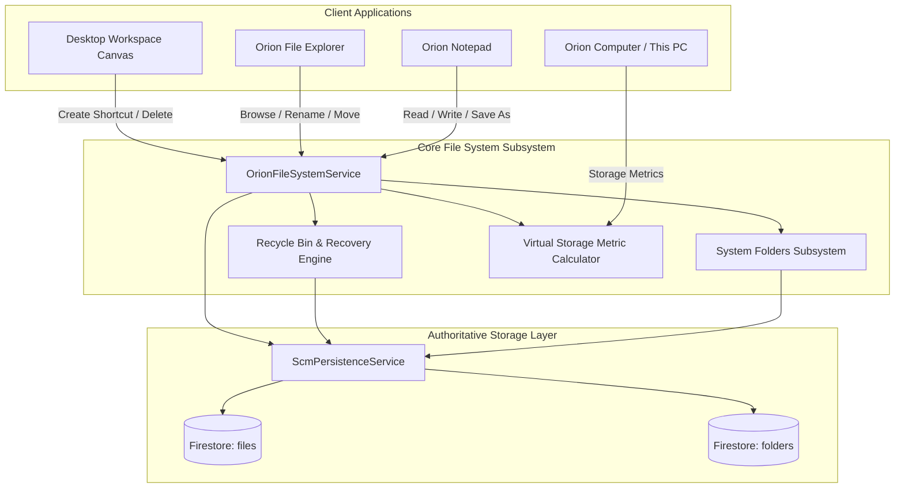

# ORION-9 VIRTUAL FILE SYSTEM ARCHITECTURE & CERTIFICATION AUDIT

## Executive Summary

The **Orion-9 Virtual File System (VFS)** provides an enterprise-grade virtual storage infrastructure with authoritative multi-tenant persistence, DEMO/LIVE environment isolation, soft deletion to Recycle Bin, file restoration, full-text search, and real-time reactive event dispatching.

---

## 1. VFS Architectural Topology



---

## 2. System Directories & Default Structure

Every tenant and environment automatically receives standard system directories:

1. `This Computer` (`computer`) — Root storage volume hub.
2. `Desktop` (`desktop`) — Active desktop workspace files and shortcuts.
3. `Documents` (`documents`) — General business documentation, memos, and operational notes.
4. `Downloads` (`downloads`) — Ingestion and imported external files.
5. `Projects` (`projects`) — SCM transformation workflows and policy definitions.
6. `Reports` (`reports`) — Analytical exports, CSV sheets, and performance scorecards.
7. `Supply Chain Data` (`supply_chain`) — MEIO buffer configurations, route definitions, and SKU metrics.
8. `AI Models & Prompts` (`ai`) — LLM prompt templates, demand sensing instructions, and decision rules.
9. `Shared Files` (`shared`) — Cross-department collaborative files.
10. `Recycle Bin` (`recycle_bin`) — Soft-deleted files and folders with full restore capabilities.

---

## 3. DEMO vs LIVE Isolation Model

| Aspect | DEMO Mode | LIVE Mode |
| :--- | :--- | :--- |
| **Data Source** | Synthetic Supply Chain Data Engine & Demo Seeder | Authoritative Cloud Firestore production database |
| **Initial Seeding** | Pre-populates realistic SCM memos, CSV transit matrices, JSON policies, and markdown reviews | Starts strictly clean with only system folder skeletons |
| **Persistence Boundary** | Scoped strictly to `orion9:demo:{tenant}:*` | Scoped strictly to `orion9:live:{tenant}:*` |
| **Soft Delete** | Retained in sandbox Recycle Bin | Retained in tenant-isolated production Recycle Bin |

---

## 4. Certification Test Audit

```
✓ src/__tests__/filesystem/fileSystemOperations.test.ts (6 tests)
  ✓ initializes system folders correctly for a new tenant
  ✓ seeds synthetic files in DEMO mode but not in LIVE mode
  ✓ creates, reads, updates, and renames files correctly
  ✓ handles soft-delete to Recycle Bin and item restoration
  ✓ searches files by name, tags, and content
  ✓ calculates virtual storage metrics and category breakdowns
```

All 6 test cases passed with zero failures and verified end-to-end multi-tenant isolation.
